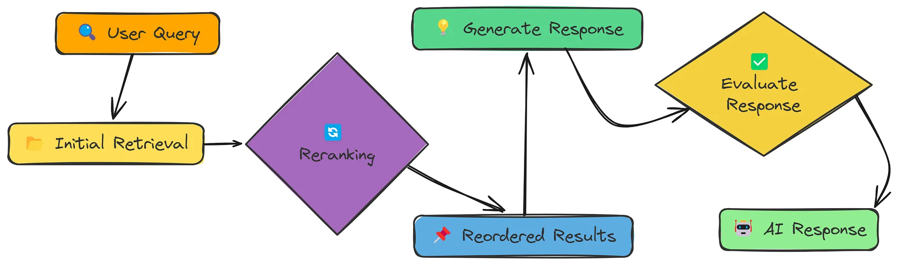

    
    <h1>Hello-RAG</h1>

  <h3>🤖 大道至简：从零开始的RAG构建及应用教程</h3>
  
<em>由浅入深，一步步带你搭建自己的RAG系统</em>

<!-- > ✨ 此仓库为中文的实现过程，并将每一步中文注释，且都跑通实现，目前基于文本进行实现，没有实现多模态的RAG。详细的内容可以去看 [RESOURCES](#RESOURCES) 哦。 -->

---

## 🏳️‍🌈 前言
`Hello-RAG` 采用从头搭建的方式，完全不依赖 `LangChain`、`LlamaIndex` 等现有框架。我们仅使用基础的 Python 库（如 `openai`、`numpy`、`fitz`（`pymupdf`）等），让开发者能够深入到 RAG 的每一个细节中，亲手构建每一个模块，从而对 RAG 的工作原理有更深入的理解。通过 `Hello-RAG`，开发者可以熟悉文本嵌入、语义检索、上下文处理和响应生成等各个流程，真正掌握 RAG 的核心。
## 🎈 内容导航
| 章节 | 关键内容 | 状态 |
| --- | --- | --- |
| [第一章 简单 RAG](./content/01_simple_rag.md) | 基本的 RAG 实现 |✅|
| [第二章 语义块切分](./content/02_semantic_chunking.md) | 根据语义相似性分割文本，以形成更有意义的块。 |✅|
| [第三章 上下文增强检索](./content/03_context_enriched_rag.md) | 获取相邻块以提供更多上下文。 |✅|
| [第四章 上下文分块标题](./content/04_contextual_chunk_headers.md) | 在嵌入之前，为每个片段添加描述性标题。 |✅|
| [第五章 文档增强 RAG](./content/05_doc_augmentation_rag.md) | 从文本片段生成问题以增强检索过程。 |✅|
| [第六章 查询转换](./content/06_query_transform.md) | 重新编写、扩展或分解查询以提高检索效果。包括回退提示和子查询分解。 |✅|
| [第七章 重新排序器](./content/07_reranker.md) | 使用 LLM 对最初检索到的结果进行重排，以获得更好的相关性。 |✅|
| [第八章 相关段落提取](./content/08_rse.md) | 识别并重建连续的文本段落，保留上下文。 |✅|
| [第九章 上下文压缩](./content/09_contextual_compression.md) | 实现上下文压缩以过滤和压缩检索到的块，最大化相关信息。 |✅|
| [第十章 反馈循环](./content/10_feedback_loop_rag.md) | 随时间推移，通过用户反馈学习并改进 RAG 系统。 |✅|
| [第十一章 适应性RAG](./content/11_adaptive_rag.md) | 根据查询类型动态选择最佳检索策略。 |✅|
| [第十二章 Self-RAG](./content/12_self_rag.md) | 动态决定何时以及如何检索，评估相关性，并评估支持和效用。 |✅|
| [第十三章 融合RAG](./content/13_fusion_rag.md) | 结合向量搜索和基于关键词（BM25）的检索，以改善结果。 |✅|
| [第十四章 图谱RAG](./content/14_graph_rag.md) | 将知识组织为图，使相关概念能够遍历。 |✅|
| [第十五章 层次索引](./content/15_hierarchy_rag.md) | 构建层次索引（摘要+详细片段），以实现高效检索。 |✅|
| [第十六章 HyDE RAG](./content/16_HyDE_rag.md) | 使用假设文档嵌入来提高语义匹配。 |✅|
| [第十七章 CRAG](./content/17_crag.md) | 动态评估检索质量，并使用网络搜索作为后备 |✅|
| **分块技术** | | |
| [块大小选择器](./content/001_chunk_size_selector.md)             | 探讨不同块大小对检索性能的影响。                             |✅|
| [命题分块](./content/00_chunk_size_selector.md)               | 将文档分解为原子事实陈述，以实现精确检索。                   |✅|

## 💡 学习建议

本项目适合大学生、研究人员、`LLM` 爱好者。在学习本项目之前，你需要具备一定的编程经验，尤其是要对 `Python` 编程语言有一定的了解。最好具备深度学习的相关知识，并了解 `RAG` 和 `LLM` 领域的相关概念和术语，以便更轻松地学习本项目。

本项目分为两部分——`RAG`和分块技术。第1章～第17章是`RAG`及其各种实现方法，从浅入深介绍 `RAG` 的基本原理。分块技术部分介绍了不同块大小对检索性能的影响，以及如何将文档分解为原子事实陈述，以实现精确检索。代码不是最主要的，重要的是理解 `RAG` 的原理，了解思路，并尝试自己实现一些模块。你可以根据个人兴趣和需求，选择性地阅读相关章节。

## 🔋 参考文档
- [all-rag-techniques](https://github.com/hemmydev/all-rag-techniques)
- [rag-all-techniques](https://github.com/liu673/rag-all-techniques)
- [Happy-LLM](https://github.com/datawhalechina/happy-llm)
- [RAG 介绍](https://www.youtube.com/watch?v=900l7z0y-yI)
<!-- ## 其他资源

- [RAG 介绍](https://www.youtube.com/watch?v=900l7z0y-yI)
检索增强生成（RAG）是一种混合方法，它结合了信息检索与生成模型。通过结合外部知识，它增强了语言模型的表现，提高了准确性和事实的正确性。

-----
实现步骤：

- **Data Ingestion（数据采集）**: 加载和预处理文本数据。
- **Chunking（分块处理）**: 将数据分割成更小的块以提高检索性能。
- **Embedding Creation（嵌入创建）**: 使用嵌入模型将文本块转换为数值表示。
- **Semantic Search（语义搜索）**: 根据用户查询检索相关块。
- **Response Generation（响应生成）**：使用语言模型根据检索到的文本生成响应。

----

- 具体代码实现过程与分析，请查看，[点击跳转🖱️](src/full/01_simple_rag.ipynb)

## Semantic Chunking

文本块切分是检索增强生成（RAG）中的关键步骤，其中将大文本体分割成有意义的段落以提高检索准确性。与固定长度块切分不同，语义块切分是根据句子之间的内容相似性来分割文本的。

------
实现步骤：

- 从PDF文件中提取文本：按句子进行切分
- 提取的文本创建语义分块：
    - 将前后两个相邻的句子计算相似度
    - 根据相似度下降计算分块的断点，断点方法有三种：百分位、标准差和四分位距
    - 然后根据断点分割文本，得到语义块
- 创建嵌入
- 根据查询并检索文档
- 将检索出来的文本用于模型生成回答

----

- 具体代码实现过程与分析，请查看，[点击跳转🖱️](src/full/02_semantic_chunking.ipynb)
- 核心函数，请查看，[点击跳转🖱️](src/core/02_semantic_chunking_core.py)

## Context Enriched Retrieval 

检索增强生成（RAG）通过从外部来源检索相关知识来增强 AI 的响应。传统的检索方法返回孤立的文本片段，这可能导致答案不完整。
为了解决这个问题，我们引入了上下文增强检索，确保检索到的信息包括相邻的片段，以实现更好的连贯性。

------
实现步骤：

- 数据采集：从 PDF 中提取文本
- 重叠上下文分块：将文本分割成重叠的块以保留上下文
- 嵌入创建：将文本块转换为数值表示
- 上下文感知检索：检索相关块及其邻居以获得更好的完整性
- 回答生成：使用语言模型根据检索到的上下文生成回答。
- 评估：使用评估数据集评估模型性能。

----

- 具体代码实现过程与分析，请查看，[点击跳转🖱️](src/full/04_context_enriched_rag.ipynb)
- 核心函数，请查看，[点击跳转🖱️](src/core/04_context_enriched_rag_core.py)

## Contextual Chunk Headers 

通过在生成响应之前检索相关外部知识，检索增强生成（RAG）提高了语言模型的事实准确性。然而，标准的分块往往丢失重要的上下文，使得检索效果不佳。
上下文块标题（CCH）通过在每个块嵌入之前添加高级上下文（如文档标题或部分标题）来增强 RAG。这提高了检索质量，并防止了不相关的响应。

------
实现步骤：

- 数据采集：从 PDF 中提取文本
- **带上下文标题的块分割：提取章节标题（或使用模型为块生成标题）并将其添加到块的开头。**
- 嵌入创建：将文本块转换为数值表示
- 语义搜索：根据用户查询检索相关块
- 回答生成：使用语言模型根据检索到的上下文生成回答。
- 评估：使用评估数据集评估模型性能。

----

- 具体代码实现过程与分析，请查看，[点击跳转🖱️](src/full/05_contextual_chunk_headers_rag.ipynb)
- 核心函数，请查看，[点击跳转🖱️](src/core/05_contextual_chunk_headers_rag_core.py)

## Document Augmentation

增强的 RAG 方法，通过文档增强和问题生成来改进。通过为每个文本块生成相关的问题，我们提高了检索过程，从而使得语言模型能够提供更好的响应。

------
实现步骤：

- 数据采集：从 PDF 文件中提取文本。
- 分块处理：将文本分割成可管理的块
- **生成问题：为每个块生成相关的问题。**
- 创建嵌入：为块和生成的问题创建嵌入。
- 向量存储创建：使用 NumPy 构建简单的向量存储。
- 语义搜索：检索与用户查询相关的片段和问题。
- 响应生成：根据检索到的内容生成答案。
- 评估：评估生成响应的质量。

----

- 具体代码实现过程与分析，请查看，[点击跳转🖱️](src/full/06_doc_augmentation_rag.ipynb)
- 核心函数，请查看，[点击跳转🖱️](src/core/06_doc_augmentation_rag_core.py)

## Query Transformation

通过修改用户查询，我们可以显著提高检索信息的关联性和全面性。

实现了三种查询转换技术，以在不依赖 LangChain 等专用库的情况下增强 RAG 系统中的检索性能。

------
核心概念

1. 查询重写：使查询更加具体和详细，从而提高搜索精度。

2. 回退提示：生成更广泛的查询，以检索有用的上下文信息。

3. 子查询分解：将复杂查询拆分为更简单的组件，以实现全面检索。

------
实现步骤：

- 处理文档以创建向量存储：从PDF 中提取文本，分割文本块并创建向量存储
- 应用查询转换技术：
    - 查询重写（Query Rewriting）：通过使查询更加具体和详细，从而提高检索的准确性
    - 回退提示（Step-back Prompting）：生成更广泛的查询以检索上下文背景信息
    - 子查询分解（Sub-query Decomposition）：将复杂查询拆分为更简单的组成部分，以实现全面检索
- 通过上面的查询转换，创建新查询嵌入并检索ß文档
- 根据检索到的内容生成回答

----

- 具体代码实现过程与分析，请查看，[点击跳转🖱️](src/full/07_query_transform.ipynb)
- 核心函数，请查看，[点击跳转🖱️](src/core/07_query_transform_core.py)

## Reranker

实现重排序技术以提高 RAG 系统中的检索质量。重排序作为初始检索后的第二步过滤，确保使用最相关的内容进行响应生成。

------
核心概念

1. **初始检索**：第一轮使用基础相似性搜索（速度较快但准确性较低）
2. **文档评分**：评估每个检索到的文档与查询的相关性
3. **重新排序**：按相关性分数对文档进行排序
4. **选择**：仅使用最相关的文档进行响应生成

------
实现步骤：

- 处理文档以创建向量存储：从PDF 中提取文本，分割文本块并创建向量存储
- 创建查询嵌入并检索文档：初步查询，需要召回较多文档
- 应用重排：
    - 基于 LLM 的重排序：使用 LLM 相关性评分对搜索结果进行重排序
    - 基于关键词的重排序：关键词匹配的次数和关键词所在位置的简单重排序方法
- 利用重排序组合成的上下文生成回答

-----

- 具体代码实现过程与分析，请查看，[点击跳转🖱️](src/full/08_reranker.ipynb)
- 核心函数，请查看，[点击跳转🖱️](src/core/08_reranker_core.py)

## RSE 

关联段落提取（Relevant Segment Extraction，RSE）技术，以提高RAG系统的上下文质量。RSE不仅仅检索一组孤立的片段，而是识别并重建提供更好上下文的连续文本段落，从而为语言模型提供更好的支持。

-----
核心概念：

相关的片段往往会在文档中聚集成簇。通过识别这些簇并保持其连续性，RSE为大型语言模型提供了更加连贯的上下文。

-----
实现步骤：

- 处理文档以创建向量存储：从PDF 中提取文本，分割文本块（0重叠）并创建向量存储
- 根据查询计算相关性分数和块值：
    - 先获取所有带有相似度分数的块；
    - 获取相关性分数，如果不在结果中则默认为0，同时应用惩罚以将不相关的块转换为负值
- 根据块值找到最佳文本块：使用最大子数组和算法的变体找到最佳
- 从最佳块中重建文本段落：基于块索引重建文本段落
- 利用将段落格式化为上下文生成回答

----

- 具体代码实现过程与分析，请查看，[点击跳转🖱️](src/full/09_rse.ipynb)
- 核心函数，请查看，[点击跳转🖱️](src/core/09_rse_core.py)

## Contextual Compression

上下文情境压缩技术（Contextual Compression），以提高 RAG 系统的效率。过滤并压缩检索到的文本块，只保留最相关的内容，从而减少噪声并提高响应质量。

在为 RAG 检索文档时，经常得到包含相关和不相关信息的块。上下文压缩可以帮助我们：

- 删除无关的句子和段落
- 仅关注与查询相关的信息
- 在上下文窗口中最大化有用信号

本文提供了三种方法：

1. 过滤（selective）：分析文档块并仅提取与用户查询直接相关的句子或段落，移除所有无关内容。
2. 摘要（summary）：创建文档块的简洁摘要，且仅聚焦与用户查询相关的信息。
3. 抽取（extraction）：从文档块中精确提取与用户查询相关的完整句子。

-----
实现步骤：

- 处理文档以创建向量存储：从PDF 中提取文本，分割文本块并创建向量存储
- 创建查询嵌入并检索文档，检索最相似的前k个块
- 对检索到的块应用压缩：
    - 过滤（selective）：分析文档块并仅提取与用户查询直接相关的句子或段落，移除所有无关内容。
    - 摘要（summary）：创建文档块的简洁摘要，且仅聚焦与用户查询相关的信息
    - 抽取（extraction）：从文档块中精确提取与用户查询相关的完整句子
- 过滤掉任何空的压缩块
- 基于压缩块形成上下文内容，然后生成回答

----

- 具体代码实现过程与分析，请查看，[点击跳转🖱️](src/full/10_contextual_compression.ipynb)
- 核心函数，请查看，[点击跳转🖱️](src/core/10_contextual_compression_core.py)

## Feedback Loop

实现一个具备反馈循环机制的RAG系统，通过持续学习实现性能迭代优化。系统将收集并整合用户反馈数据，使每次交互都能提升回答的相关性与质量。

-----
传统RAG系统采用静态检索模式，仅依赖嵌入相似性获取信息。而本系统通过反馈循环构建动态优化框架，实现：

- 记忆有效/无效的交互模式
- 动态调整文档相关性权重
- 将优质问答对整合至知识库
- 通过用户互动持续增强智能水平

-----
实现步骤：

- 加载历史反馈数据集
- 文档预处理与分块处理
- 可选基于历史反馈微调向量索引
- 基于反馈修正的相关性评分执行检索与生成
- 收集新用户反馈数据用于后续优化
- 持久化存储反馈数据支撑系统持续学习能力

----

- 具体代码实现过程与分析，请查看，[点击跳转🖱️](src/full/11_feedback_loop_rag.ipynb)
- 核心函数，请查看，[点击跳转🖱️](src/core/11_feedback_loop_rag_core.py)

## Adaptive RAG

自适应检索(Adaptive Retrieval)系统可根据查询类型动态选择最优检索策略，该方法显著提升RAG系统在多样化问题场景下的响应准确性与相关性。

-----
不同查询类型需匹配差异化检索策略，本系统实现四阶优化流程：

1. 查询类型分类（事实性/分析性/意见性/上下文型）
2. 自适应选择检索策略
3. 执行专门的检索技术
4. 生成定制化响应

-----
实现步骤：

- 处理文档以提取文本，将其分块，并创建嵌入向量
- 对查询进行分类以确定其类型：查询分为事实性（Factual）、分析性（Analytical）、意见性（Opinion）或上下文相关性（Contextual）。
- 根据查询类型使用自适应检索策略检索文档
- 根据查询、检索到的文档和查询类型生成回答

----

- 具体代码实现过程与分析，请查看，[点击跳转🖱️](src/full/12_adaptive_rag.ipynb)
- 核心函数，请查看，[点击跳转🖱️](src/core/12_adaptive_rag_core.py)

## Self RAG

Self-RAG——这是一个先进的 RAG 系统，能够动态决定何时以及如何使用检索到的信息。与传统 RAG 方法不同，Self-RAG
在整个检索和生成过程中引入了反思点，从而产生更高品质和更可靠的回答。

-----
Self-RAG 核心组件

1. **检索决策**：判断特定查询是否需要执行检索
2. **文档检索**：在需要时获取潜在相关文档
3. **相关性评估**：评估每个检索文档的相关程度
4. **响应生成**：基于相关上下文构建回答
5. **支持性评估**：验证回答是否基于上下文正确锚定
6. **效用评估**：对生成回答的整体实用性进行评分

-----
实现步骤：

- 确定是否需要检索，检索决策：LLM判断是否需要检索，事实性的查询需要检索，观点类的查询不需要检索
- 检索文档：创建查询的嵌入向量然后检索文档
- 评估文档相关性：用模型评估每个文档块的相关性，如果相关，将其加入上下文列表中
- 处理每个相关上下文，用模型进行支持性评估和效用评估
- 找出最佳答案：对生成的答案进行效用评估，并选择最佳答案

----

- 具体代码实现过程与分析，请查看，[点击跳转🖱️](src/full/13_self_rag.ipynb)
- 核心函数，请查看，[点击跳转🖱️](src/core/13_self_rag_core.py)

## Fusion RAG

实现一个融合检索系统，将语义向量搜索与基于关键词的BM25检索优势相结合。这种方法通过同时捕获概念相似性和精确关键词匹配，提升了检索质量。

-----
为什么融合检索很重要?

传统的RAG系统通常仅依赖向量搜索，但这存在局限性：

- 向量搜索擅长捕捉语义相似性，但可能遗漏精确关键词匹配
- 关键词搜索适合特定术语检索，但缺乏语义理解能力
- 不同类型的查询在不同检索方法中表现差异显著

-----
融合检索通过以下方式实现优势互补：

- 并行执行基于向量和基于关键词的检索
- 对两种方法的得分进行标准化处理
- 通过加权公式组合两者结果
- 基于综合得分对文档进行重新排序

-----
实现步骤：

- 从 PDF 文件中提取文本
- 使用 jieba 分词器对文本进行分词，并创建向量存储
- 使用 BM25 算法对查询进行关键词匹配
- 使用向量搜索对查询进行语义匹配
- 将两种方法的结果进行加权组合，并重新排序
- 返回最终的搜索结果

----

- 具体代码实现过程与分析，请查看，[点击跳转🖱️](src/full/16_fusion_rag.ipynb)
- 核心函数，请查看，[点击跳转🖱️](src/core/16_fusion_rag_core.py)

## Graph RAG

Graph RAG - 一种通过将知识组织为连接图来增强传统RAG系统的技巧，而不是将知识作为平面文档集合。这使得系统能够导航相关概念，并找到比标准向量相似性方法更符合上下文的相关信息。

------
Graph RAG的关键优势

- 保留信息之间的关系
- 通过连接的概念启用上下文的遍历
- 提高处理复杂、多部分查询的能力
- 通过可视化知识路径提供更好的解释性

------
实现步骤：

- 从PDF中提取文本
- 将提取的文本分割成重叠的块
- 从文本块构建知识图谱，用模型从文本块中总结出关键概念，然后利用关键概念构建知识图谱节点，根据概念重叠和语义相似性计算边权重，设置边，从而创建知识图谱
- 遍历知识图谱以找到与查询相关的信息，计算查询与所有节点之间的相似度，按相似度排序（降序），获取最相似的前 top-k
  个节点作为起点，使用优先队列进行广度遍历，查找出与查询最相关的信息
- 根据查询和相关块生成响应

----

- 具体代码实现过程与分析，请查看，[点击跳转🖱️](src/full/17_graph_rag.ipynb)
- 核心函数，请查看，[点击跳转🖱️](src/core/17_graph_rag_core.py)

## Hierarchical Indices

实现一种用于RAG系统的分级索引方法(Hierarchical Indices)。这种技术通过使用两级搜索方法来提高检索效果：首先通过摘要识别相关的文档部分，然后从这些部分中检索具体细节。

-----
传统的RAG方法将所有文本块一视同仁，这可能导致：

- 当文本块过小时，上下文信息丢失
- 当文档集合较大时，检索结果无关
- 在整个语料库中搜索效率低下

-----
分级检索解决了这些问题，具体方式如下：

- 为较大的文档部分创建简洁的摘要
- 首先搜索这些摘要以确定相关部分
- 然后仅从这些部分中检索详细信息
- 在保留具体细节的同时保持上下文信息

-----
实现步骤：

- 从 PDF 中提取页面
- 为每一页创建摘要，将摘要文本和元数据添加到摘要列表中
- 为每一页创建详细块，将页面的文本切分为块
- 为以上两个创建嵌入，并行其存入向量存储中
- 使用查询分层检索相关块：先检索相关的摘要，收集来自相关摘要的页面，然后过滤掉不是相关页面的块，从这些相关页面检索详细块
- 根据检索到的块生成回答

----

- 具体代码实现过程与分析，请查看，[点击跳转🖱️](src/full/18_hierarchy_rag.ipynb)
- 核心函数，请查看，[点击跳转🖱️](src/core/18_hierarchy_rag_core.py)

## HyDE

实现 HyDE（Hypothetical Document Embedding，假设文档嵌入）——这是一种创新的检索技术，它将用户查询转化为假设性的回答文档后再进行检索。这种方法弥补了短查询与长文档之间的语义差距。

------
传统的 RAG（Retrieval-Augmented Generation，检索增强生成）系统是直接对用户的简短查询进行嵌入处理，但这种方式往往无法捕捉到最佳检索所需的丰富语义信息。HyDE
通过以下方式解决了这一问题：

- **生成一个假设性文档来回答该查询**
- **对该扩展后的文档进行嵌入，而非原始查询**
- **检索与该假设文档相似的文档**
- **从而生成更加上下文相关的回答**

------
实现步骤：

- 从PDF文件中提取文本内容
- 分割文本为块
- 创建一个向量存储，将文本块和元数据存储为向量
- 根据用户查询，利用模型回答用户的查询（生成假设性文档）
- 为假设文档创建嵌入
- 根据假设文档检索相似的片段
- 然后利用检索到的片段构成上下文，生成回答

----

- 具体代码实现过程与分析，请查看，[点击跳转🖱️](src/full/19_HyDE_rag.ipynb)
- 核心函数，请查看，[点击跳转🖱️](src/core/19_HyDE_rag_core.py)

## Crag

实现**纠错型RAG（Corrective RAG）**——一种先进的方法，能够动态评估检索到的信息，并在必要时对检索过程进行修正，使用网络搜索作为备选方案。

-----
CRAG 在传统 RAG 的基础上进行了以下改进：

- 在使用前对检索到的内容进行评估
- 根据相关性动态切换不同的知识源
- 当本地知识不足以回答问题时，通过网络搜索修正检索结果
- 在适当时合并多个来源的信息

-----
实现步骤：

- 处理文档并创建向量数据库
- 创建查询嵌入并检索文档
- 评估文档相关性：对检索到的内容进行评估。
- 根据情况执行相应的知识获取策略：高相关性（评估分数>0.7）,直接使用文档内容；低相关性（评估分数<
  0.3）使用网络搜索；中等相关性（0.3-0.7）结合文档与网络搜索结果，并将文档结果与网络搜索结果进行合并。在混合搜索中，需要将搜索出来的内容，进行模型提炼，避免内容重复冗余。
- 生成最终回答

----

- 具体代码实现过程与分析，请查看，[点击跳转🖱️](src/full/20_crag.ipynb)
- 核心函数，请查看，[点击跳转🖱️](src/core/20_crag_core.py)

## 分块技术

### 不同块大小

选择合适的块大小对于提高检索增强生成（RAG）管道的检索准确性至关重要。目标是平衡检索性能与响应质量。

-----
以下方式评估不同的块大小:

- 从 PDF 中提取文本
- 将文本分割成不同大小的块
- 为每个块创建嵌入
- 为查询检索相关块
- 使用检索到的块生成响应
- 评估响应质量
- 比较不同块大小的结果

-----
实现步骤:

- 从 PDF 中提取文本：按页获取页面文本
- 将文本分割成不同大小的块，为每个块创建嵌入
- 根据查询检索相关块
- 使用检索到的文本块用模型生成回答
- 评估不同大小块的检索回答质量

----

- 具体代码实现过程与分析，请查看，[点击跳转🖱️](src/full/03_chunk_size_selector.ipynb)
- 核心函数，请查看，[点击跳转🖱️](src/core/03_chunk_size_selector_core.py)

### 命题分块技术

命题分块技术（Proposition Chunking）——这是一种通过将文档分解为原子级事实陈述来实现更精准检索的先进方法。与传统仅按字符数分割文本的分块方式不同，命题分块能保持单个事实的语义完整性。

-----
命题分块通过以下方式实现更精确的检索：

1. 将内容分解为原子化的、自包含的事实陈述
2. 创建更小、更细粒度的检索单元
3. 实现查询与相关内容间更精确的匹配
4. 过滤掉低质量或不完整的命题

-----
实现步骤：

- 从PDF文件中提取文本
- 从提取的文本创建分块
- 分块生成命题
- 为每个命题进行评估

----

- 具体代码实现过程与分析，请查看，[点击跳转🖱️](src/full/14_proposition_chunking.ipynb)
- 核心函数，请查看，[点击跳转🖱️](src/core/14_propostion_chunking_core.py) 

## RESOURCES:
- https://levelup.gitconnected.com/testing-18-rag-techniques-to-find-the-best-094d166af27f
- https://github.com/FareedKhan-dev/all-rag-techniques -->
