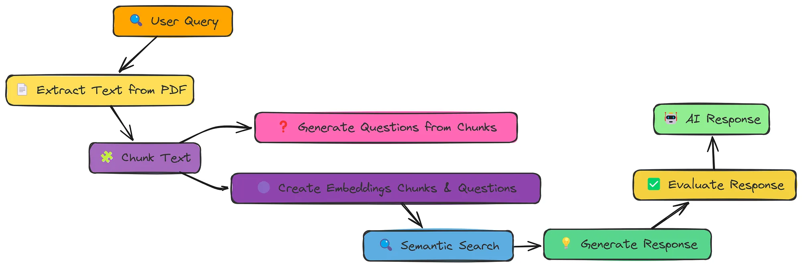

# 文档增强 RAG 与问题生成

增强的 RAG 方法，通过文档增强和问题生成来改进。通过为每个文本块生成相关的问题，我们提高了检索过程，从而使得语言模型能够提供更好的响应。

------
实现步骤：
- 数据采集：从 PDF 文件中提取文本。
- 分块处理：将文本分割成可管理的块
- **生成问题：为每个块生成相关的问题。**
- 创建嵌入：为块和生成的问题创建嵌入。
- 向量存储创建：使用 NumPy 构建简单的向量存储。
- 语义搜索：检索与用户查询相关的片段和问题。
- 响应生成：根据检索到的内容生成答案。
- 评估：评估生成响应的质量。


```python
import fitz
import os
import re
import json
import numpy as np
from tqdm import tqdm
from openai import OpenAI
from dotenv import load_dotenv

load_dotenv()
```


    True


```python
client = OpenAI(
    base_url=os.getenv("LLM_BASE_URL"),
    api_key=os.getenv("LLM_API_KEY")
)
llm_model = os.getenv("LLM_MODEL_ID")
embedding_model = os.getenv("EMBEDDING_MODEL_ID")

pdf_path = "../../data/AI_Information.en.zh-CN.pdf"
```

# 5.1 提取文本并识别章节标题


```python
def extract_text_from_pdf(pdf_path):
    """
    从 PDF 文件中提取文本，并打印前 `num_chars` 个字符。

    Args:
    pdf_path (str): Path to the PDF file.

    Returns:
    str: Extracted text from the PDF.
    """
    # 打开 PDF 文件
    mypdf = fitz.open(pdf_path)
    all_text = ""  # 初始化一个空字符串以存储提取的文本

    # Iterate through each page in the PDF
    for page_num in range(mypdf.page_count):
        page = mypdf[page_num]
        text = page.get_text("text")  # 从页面中提取文本
        all_text += text  # 将提取的文本追加到 all_text 字符串中

    return all_text  # 返回提取的文本
```

# 5.2 对提取的文本进行分块


```python
def chunk_text(text, n, overlap):
    """
    将文本分割为重叠的块

    Args:
    text (str): 要分割的文本
    n (int): 每个块的字符数
    overlap (int): 块之间的重叠字符数

    Returns:
    List[str]: 文本块列表
    """
    chunks = []  #
    for i in range(0, len(text), n - overlap):
        # 添加从当前索引到索引 + 块大小的文本块
        chunks.append(text[i:i + n])

    return chunks  # Return the list of text chunks
```

# 5.3 为文本块生成问题
这是对简单 RAG 的关键增强。我们为每个文本块生成可以通过该文本块回答的问题


```python
def generate_questions(text_chunk, num_questions=5):
    """
    生成可以从给定文本块中回答的相关问题。

    Args:
    text_chunk (str): 要生成问题的文本块。
    num_questions (int): 要生成的问题数量。
    model (str): 用于生成问题的模型。

    Returns:
    List[str]: 生成的问题列表。
    """
    # 定义系统提示
    system_prompt = "你是一个从文本中生成相关问题的专家。能够根据用户提供的文本生成可回答的简洁问题，重点聚焦核心信息和关键概念。"

    # 定义用户提示，包含文本块和要生成的问题数量
    # user_prompt = f"""
    # 根据以下文本，生成 {num_questions} 个不同的问题，这些问题只能通过此文本回答：
    #
    # {text_chunk}
    #
    # 请以编号列表的形式回复问题，且不要添加任何额外文本。
    # """
    user_prompt = f"""
    请根据以下文本内容生成{num_questions}个不同的、仅能通过该文本内容回答的问题：

    {text_chunk}

    请严格按以下格式回复：
    1. 带编号的问题列表
    2. 仅包含问题
    3. 不要添加任何其他内容
    """

    # 使用 OpenAI API 生成问题
    response = client.chat.completions.create(
        model=llm_model,
        temperature=0.7,
        messages=[
            {"role": "system", "content": system_prompt},
            {"role": "user", "content": user_prompt}
        ]
    )

    # 从响应中提取并清理问题
    questions_text = response.choices[0].message.content.strip()

    # 使用正则表达式模式匹配提取问题
    pattern = r'^\d+\.\s*(.*)'
    return [re.match(pattern, line).group(1) for line in questions_text.split('\n') if line.strip()]
    # 此处改变了原有的正则处理，避免生成的问题中没有问号以及中英文问号匹配的问题
    # questions = []
    # for line in questions_text.split('\n'):
    #     # 去除编号并清理空白
    #     cleaned_line = re.sub(r'^\d+\.\s*', '', line.strip())
    #     # if cleaned_line and cleaned_line.endswith('？') or cleaned_line.endswith("?"):
    #     #     questions.append(cleaned_line)
    #
    # return questions

```


```python
# 测试根据文本块生成的问题

print("从 PDF 中提取文本...")
extracted_text = extract_text_from_pdf(pdf_path)

print("分割文本...")
text_chunks = chunk_text(extracted_text, 1000, 200)
print(f"创建了 {len(text_chunks)} 个文本块")

print("处理文本块并生成问题...")

for i, chunk in enumerate(tqdm(text_chunks, desc="处理文本块")):
    questions = generate_questions(chunk, num_questions=5)
    print("Generated Questions:")
    print(questions)
    print("生成问题".center(80, '-'))

    if i == 0:
        break
```

# 5.4 文本创建嵌入


```python
def create_embeddings(text):
    """
    为给定文本创建嵌入向量，使用指定的 OpenAI 模型。

    Args:
    text (str): 要为其创建嵌入向量的输入文本。
    model (str): 用于创建嵌入向量的模型。

    Returns:
    dict: 包含嵌入向量的 OpenAI API 响应。
    """
    # 使用指定模型为输入文本创建嵌入向量
    response = client.embeddings.create(
        model=embedding_model,
        input=text
    )

    return response  # 返回包含嵌入向量的响应

```

# 5.5 向量存储创建

使用Numpy建立一个简单的向量存储


```python
class SimpleVectorStore:
    """
    使用 NumPy 实现的简单向量存储。
    """

    def __init__(self):
        """
        初始化向量存储。
        """
        self.vectors = []  # 存储向量
        self.texts = []  # 存储原始文本
        self.metadata = []  # 存储元数据

    def add_item(self, text, embedding, metadata=None):
        """
        向向量存储中添加一个项目。

        Args:
        text (str): 原始文本。
        embedding (List[float]): 嵌入向量。
        metadata (dict, optional): 额外的元数据。
        """
        self.vectors.append(np.array(embedding))  # 将嵌入向量转换为 NumPy 数组并存储
        self.texts.append(text)  # 存储原始文本
        self.metadata.append(metadata or {})  # 存储元数据（如果未提供，则使用空字典）

    def similarity_search(self, query_embedding, k=5):
        """
        查找与查询嵌入向量最相似的项目。

        Args:
        query_embedding (List[float]): 查询嵌入向量。
        k (int): 返回的结果数量。

        Returns:
        List[Dict]: 最相似的前 k 个项目及其文本和元数据。
        """
        if not self.vectors:  # 如果向量列表为空，返回空列表
            return []

        # 将查询嵌入向量转换为 NumPy 数组
        query_vector = np.array(query_embedding)

        # 使用余弦相似度计算相似度
        similarities = []
        for i, vector in enumerate(self.vectors):  # 遍历所有向量
            similarity = np.dot(query_vector, vector) / (np.linalg.norm(query_vector) * np.linalg.norm(vector))
            similarities.append((i, similarity))  # 存储索引和相似度

        # 按相似度降序排序
        similarities.sort(key=lambda x: x[1], reverse=True)

        # 返回前 k 个结果
        results = []
        for i in range(min(k, len(similarities))):  # 确保不会超出向量数量
            idx, score = similarities[i]
            results.append({
                "text": self.texts[idx],  # 对应的文本
                "metadata": self.metadata[idx],  # 对应的元数据
                "similarity": score  # 相似度分数
            })

        return results

```

# 5.6 使用问题增强处理文档
所有步骤整合在一起，用于处理文档、生成问题，并构建增强型向量存储。


```python
def process_document(pdf_path, chunk_size=1000, chunk_overlap=200, questions_per_chunk=5):
    """
    处理带有问题增强功能的文档。

    Args:
    pdf_path (str): PDF 文件的路径。
    chunk_size (int): 每个文本块的字符大小。
    chunk_overlap (int): 块之间的重叠字符数。
    questions_per_chunk (int): 每个块生成的问题数量。

    Returns:
    Tuple[List[str], SimpleVectorStore]: 文本块列表和向量存储。
    """
    print("从 PDF 中提取文本...")
    extracted_text = extract_text_from_pdf(pdf_path)

    print("分割文本...")
    text_chunks = chunk_text(extracted_text, chunk_size, chunk_overlap)
    print(f"创建了 {len(text_chunks)} 个文本块")

    vector_store = SimpleVectorStore()

    print("处理文本块并生成问题...")
    for i, chunk in enumerate(tqdm(text_chunks, desc="处理文本块")):
        # 为文本块本身创建嵌入
        chunk_embedding_response = create_embeddings(chunk)
        chunk_embedding = chunk_embedding_response.data[0].embedding

        # 将文本块添加到向量存储中
        vector_store.add_item(
            text=chunk,
            embedding=chunk_embedding,
            metadata={"type": "chunk", "index": i}
        )

        # 为该文本块生成问题
        questions = generate_questions(chunk, num_questions=questions_per_chunk)

        # 为每个问题创建嵌入并添加到向量存储中
        for j, question in enumerate(questions):
            question_embedding_response = create_embeddings(question)
            question_embedding = question_embedding_response.data[0].embedding

            # 将问题添加到向量存储中
            vector_store.add_item(
                text=question,
                embedding=question_embedding,
                metadata={"type": "question", "chunk_index": i, "original_chunk": chunk}
            )

    return text_chunks, vector_store

```

# 5.7 提取和处理文档


```python
# 处理文档（提取文本、创建块、生成问题、构建向量存储）
text_chunks, vector_store = process_document(
    pdf_path,
    chunk_size=1000,  # 每个文本块的字符大小为1000
    chunk_overlap=200,  # 块之间的重叠字符数为200
    questions_per_chunk=3  # 每个块生成3个问题
)

# 打印向量存储中的项目数量
print(f"向量存储包含 {len(vector_store.texts)} 个项目")  # 13*4=52，一个块由1个chunk,3个question组成

```

    从 PDF 中提取文本...
    分割文本...
    创建了 13 个文本块
    处理文本块并生成问题...


    处理文本块: 100%|██████████| 13/13 [00:41<00:00,  3.17s/it]

    向量存储包含 52 个项目


    


# 5.8 语义检索

实现了一个语义搜索功能，该功能类似于简单的RAG（检索增强生成）实现，但针对我们的增强型向量存储进行了适应性调整。


```python
def semantic_search(query, vector_store, k=5):
    """
    使用查询和向量存储执行语义搜索。

    Args：
    query (str): 搜索查询。
    vector_store (SimpleVectorStore): 要搜索的向量存储。
    k (int): 返回的结果数量。

    Returns：
    List[Dict]: 最相关的前 k 个结果列表，每个结果包含文本和元数据信息。
    """
    # 为查询创建嵌入
    query_embedding_response = create_embeddings(query)
    query_embedding = query_embedding_response.data[0].embedding

    # 搜索向量存储
    results = vector_store.similarity_search(query_embedding, k=k)

    return results

```

# 5.9 在向量存储中搜索问题


```python
# 加载来自 JSON 文件的验证数据
with open('../../data/val.json', mode="r", encoding="utf-8") as f:
    data = json.load(f)

# 从验证数据中提取第一个查询
query = data[0]['question']

# 执行语义搜索以找到相关的内容
search_results = semantic_search(query, vector_store, k=5)

print("Query:", query)  # 打印查询内容
print("\nSearch Results:")  # 打印搜索结果标题

# 按类型组织结果
chunk_results = []  # 存储文档块的结果
question_results = []  # 存储问题的结果

# 将搜索结果分为文档块和问题两类
for result in search_results:
    if result["metadata"]["type"] == "chunk":  # 如果结果是文档块类型
        chunk_results.append(result)
    else:  # 如果结果是问题类型
        question_results.append(result)

# 打印文档块结果
print("\nRelevant Document Chunks:")  # 打印相关文档块标题
for i, result in enumerate(chunk_results):
    print(f"Context {i + 1} (similarity: {result['similarity']:.4f}):")  # 打印每个文档块的相似度分数
    print(result["text"][:300] + "...")  # 打印文档块的前300个字符
    print("=====================================")  # 分隔符

# 打印匹配的问题
print("\nMatched Questions:")  # 打印匹配问题标题
for i, result in enumerate(question_results):
    print(f"Question {i + 1} (similarity: {result['similarity']:.4f}):")  # 打印每个问题的相似度分数
    print(result["text"])  # 打印问题内容
    chunk_idx = result["metadata"]["chunk_index"]  # 获取问题所属的文档块索引
    print(f"From chunk {chunk_idx}")  # 打印问题来源的文档块索引
    print("=====================================")  # 分隔符

```

    Query: 什么是‘可解释人工智能’，为什么它被认为很重要？
    
    Search Results:
    
    Relevant Document Chunks:
    
    Matched Questions:
    Question 1 (similarity: 0.9426):
    可解释人工智能(XAI)技术的主要作用是什么？
    From chunk 10
    =====================================
    Question 2 (similarity: 0.9400):
    可解释人工智能（XAI）的主要目标是什么？
    From chunk 3
    =====================================
    Question 3 (similarity: 0.9400):
    可解释人工智能（XAI）的研究重点是什么？
    From chunk 8
    =====================================
    Question 4 (similarity: 0.9350):
    为什么透明度和可解释性对建立人工智能系统的信任至关重要？
    From chunk 11
    =====================================
    Question 5 (similarity: 0.9158):
    人工智能（AI）的定义是什么？  
    From chunk 0
    =====================================


# 5.10 生成响应的上下文
现在我们通过结合相关文档块和问题的信息来准备上下文。


```python
def prepare_context(search_results):
    """
    从语义搜索结果中准备一个统一的上下文，用于生成回答。

    Args:
    search_results (List[Dict]): 语义搜索的结果。

    Returns:
    str: 合并后的上下文字符串。
    """
    # 提取结果中引用的独特文档块
    chunk_indices = set()
    context_chunks = []

    # 首先添加直接匹配的文档块
    for result in search_results:
        if result["metadata"]["type"] == "chunk":
            chunk_indices.add(result["metadata"]["index"])
            context_chunks.append(f"Chunk {result['metadata']['index']}:\n{result['text']}")

    # 然后添加由问题引用的文档块
    for result in search_results:
        if result["metadata"]["type"] == "question":
            chunk_idx = result["metadata"]["chunk_index"]
            if chunk_idx not in chunk_indices:
                chunk_indices.add(chunk_idx)
                context_chunks.append(
                    f"Chunk {chunk_idx} (referenced by question '{result['text']}'):\n{result['metadata']['original_chunk']}")

    # 合并所有上下文块
    full_context = "\n\n".join(context_chunks)
    return full_context

```

# 5.11 根据检索的文本块生成回答


```python
def generate_response(query, context):
    """
    根据查询和上下文生成回答。

    Args:
    query (str): 用户的问题。
    context (str): 从向量存储中检索到的上下文信息。
    model (str): 用于生成回答的模型。

    Returns:
    str: 生成的回答。
    """
    # 定义系统提示，指导AI助手严格基于给定的上下文进行回答。
    # 如果无法直接从提供的上下文中得出答案，则回复：“我没有足够的信息来回答这个问题。”
    system_prompt = "你是一个AI助手，严格根据给定的上下文进行回答。如果无法直接从提供的上下文中得出答案，请回复：'我没有足够的信息来回答这个问题。'"

    # 构建用户提示，包含上下文和问题。
    # 要求AI助手仅基于提供的上下文回答问题，并保持简洁和准确。
    user_prompt = f"""
        上下文内容:
        {context}

        问题: {query}

        请仅根据上述上下文回答问题, 并保持简明扼要。
    """

    # 使用指定的模型生成回答。
    # 设置temperature为0以确保输出更确定和一致。
    response = client.chat.completions.create(
        model=llm_model,
        temperature=0,
        messages=[
            {"role": "system", "content": system_prompt},
            {"role": "user", "content": user_prompt}
        ]
    )

    # 返回生成的回答内容。
    return response.choices[0].message.content

```


```python
# Prepare context from search results
context = prepare_context(search_results)

# Generate response
response_text = generate_response(query, context)

print("\nQuery:", query)
print("\nResponse:")
print(response_text)
```

    
    Query: 什么是‘可解释人工智能’，为什么它被认为很重要？
    
    Response:
    可解释人工智能（XAI）旨在使人工智能系统的决策过程更加透明易懂，帮助用户理解其决策方式和依据。它被认为很重要是因为能增强对AI系统的信任、提高问责制，并确保其公平性和准确性。


# 5.12 评估


```python
def evaluate_response(query, response, reference_answer):
    """
    对AI生成的回答进行评估，将其与参考答案进行对比。

    Args:
    query (str): 用户的问题。
    response (str): AI生成的回答。
    reference_answer (str): 参考/理想答案。
    model (str): 用于评估的模型。

    Returns:
    str: 评估反馈。
    """
    # 定义评估系统的系统提示
    evaluate_system_prompt = """您是一个智能评估系统，负责评估AI回答的质量。
    请将AI助手的回答与真实/参考答案进行对比，基于以下几点进行评估：
        1. 事实正确性 - 回答是否包含准确信息？
        2. 完整性 - 是否涵盖参考内容的所有重要方面？
        3. 相关性 - 是否直接针对问题作出回应？

        请分配0到1之间的评分：
        - 1.0：内容与含义完全匹配
        - 0.8：非常好，仅有少量遗漏/差异
        - 0.6：良好，涵盖主要要点但遗漏部分细节
        - 0.4：部分正确答案但存在显著遗漏
        - 0.2：仅包含少量相关信息
        - 0.0：错误或无关信息

    请提供评分并附理由说明。
    """

    # 创建评估提示
    # 包含用户问题、AI回答、参考答案以及要求评估的内容。
    evaluation_prompt = f"""
        用户问题: {query}

        AI回答:
        {response}

        参考答案:
        {reference_answer}

        请根据参考答案评估AI的回答。
    """

    # 生成评估结果
    # 使用指定的模型生成评估结果。
    eval_response = client.chat.completions.create(
        model=llm_model,
        temperature=0,
        messages=[
            {"role": "system", "content": evaluate_system_prompt},
            {"role": "user", "content": evaluation_prompt}
        ]
    )

    # 返回评估内容
    return eval_response.choices[0].message.content

```


```python
# Get reference answer from validation data
reference_answer = data[0]['ideal_answer']

# Evaluate the response
evaluation = evaluate_response(query, response_text, reference_answer)

print("\nEvaluation:")
print(evaluation)
```

    
    Evaluation:
    评分：1.0
    
    理由说明：
    AI的回答与参考答案在内容与含义上完全匹配。两者都准确地定义了可解释人工智能（XAI）的核心目标，即提高透明度和可理解性，并强调了其重要性在于建立信任、问责制和确保公平性。AI的回答甚至比参考答案更详细一些，提到了“准确性”，这进一步丰富了回答的内容。因此，该回答完全符合评估标准，应给予满分。

