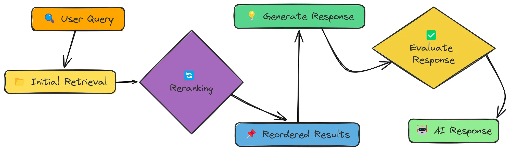

# 增强 RAG 系统的重排

实现重排序技术以提高 RAG 系统中的检索质量。重排序作为初始检索后的第二步过滤，确保使用最相关的内容进行响应生成。

------
重排序的核心概念

1. **初始检索**：第一轮使用基础相似性搜索（速度较快但准确性较低）
2. **文档评分**：评估每个检索到的文档与查询的相关性
3. **重新排序**：按相关性分数对文档进行排序
4. **选择**：仅使用最相关的文档进行响应生成

------
实现步骤：
- 处理文档以创建向量存储：从PDF 中提取文本，分割文本块并创建向量存储
- 创建查询嵌入并检索文档：初步查询，需要召回较多文档
- 应用重排：
    - 基于 LLM 的重排序：使用 LLM 相关性评分对搜索结果进行重排序
    - 基于关键词的重排序：关键词匹配的次数和关键词所在位置的简单重排序方法
- 利用重排序组合成的上下文生成回答


```python
import fitz
import os
import re
import json
import numpy as np
from tqdm import tqdm
from openai import OpenAI
from dotenv import load_dotenv

load_dotenv()
```


    True


```python
client = OpenAI(
    base_url=os.getenv("LLM_BASE_URL"),
    api_key=os.getenv("LLM_API_KEY")
)
llm_model = os.getenv("LLM_MODEL_ID")
embedding_model = os.getenv("EMBEDDING_MODEL_ID")

pdf_path = "../../data/AI_Information.en.zh-CN.pdf"
```


```python
def extract_text_from_pdf(pdf_path):
    """
    从 PDF 文件中提取文本，并打印前 `num_chars` 个字符。

    Args:
    pdf_path (str): Path to the PDF file.

    Returns:
    str: Extracted text from the PDF.
    """
    # 打开 PDF 文件
    mypdf = fitz.open(pdf_path)
    all_text = ""  # 初始化一个空字符串以存储提取的文本

    # Iterate through each page in the PDF
    for page_num in range(mypdf.page_count):
        page = mypdf[page_num]
        text = page.get_text("text")  # 从页面中提取文本
        all_text += text  # 将提取的文本追加到 all_text 字符串中

    return all_text  # 返回提取的文本
```


```python
def chunk_text(text, n, overlap):
    """
    将文本分割为重叠的块

    Args:
    text (str): 要分割的文本
    n (int): 每个块的字符数
    overlap (int): 块之间的重叠字符数

    Returns:
    List[str]: 文本块列表
    """
    chunks = []  #
    for i in range(0, len(text), n - overlap):
        # 添加从当前索引到索引 + 块大小的文本块
        chunks.append(text[i:i + n])

    return chunks  # Return the list of text chunks
```


```python
class SimpleVectorStore:
    """
    使用NumPy实现的简单向量存储。
    """
    def __init__(self):
        """
        初始化向量存储。
        """
        self.vectors = []  # 用于存储嵌入向量的列表
        self.texts = []  # 用于存储原始文本的列表
        self.metadata = []  # 用于存储每个文本元数据的列表

    def add_item(self, text, embedding, metadata=None):
        """
        向向量存储中添加一个项目。

        Args:
        text (str): 原始文本。
        embedding (List[float]): 嵌入向量。
        metadata (dict, 可选): 额外的元数据。
        """
        self.vectors.append(np.array(embedding))  # 将嵌入转换为numpy数组并添加到向量列表中
        self.texts.append(text)  # 将原始文本添加到文本列表中
        self.metadata.append(metadata or {})  # 添加元数据到元数据列表中，如果没有提供则使用空字典

    def similarity_search(self, query_embedding, k=5):
        """
        查找与查询嵌入最相似的项目。

        Args:
        query_embedding (List[float]): 查询嵌入向量。
        k (int): 返回的结果数量。

        Returns:
        List[Dict]: 包含文本和元数据的前k个最相似项。
        """
        if not self.vectors:
            return []  # 如果没有存储向量，则返回空列表

        # 将查询嵌入转换为numpy数组
        query_vector = np.array(query_embedding)

        # 使用余弦相似度计算相似度
        similarities = []
        for i, vector in enumerate(self.vectors):
            # 计算查询向量与存储向量之间的余弦相似度
            similarity = np.dot(query_vector, vector) / (np.linalg.norm(query_vector) * np.linalg.norm(vector))
            similarities.append((i, similarity))  # 添加索引和相似度分数

        # 按相似度排序（降序）
        similarities.sort(key=lambda x: x[1], reverse=True)

        # 返回前k个结果
        results = []
        for i in range(min(k, len(similarities))):
            idx, score = similarities[i]
            results.append({
                "text": self.texts[idx],  # 添加对应的文本
                "metadata": self.metadata[idx],  # 添加对应的元数据
                "similarity": score  # 添加相似度分数
            })

        return results  # 返回前k个最相似项的列表

```


```python
def create_embeddings(text):
    """
    使用Embedding模型为给定文本创建嵌入向量。

    Args:
    text (str): 要创建嵌入向量的输入文本。

    Returns:
    List[float]: 嵌入向量。
    """
    # 通过将字符串输入转换为列表来处理字符串和列表输入
    input_text = text if isinstance(text, list) else [text]

    # 使用指定的模型为输入文本创建嵌入向量
    response = client.embeddings.create(
        model=embedding_model,
        input=input_text
    )

    # 如果输入是字符串，仅返回第一个嵌入向量
    if isinstance(text, str):
        return response.data[0].embedding

    # 否则，将所有嵌入向量作为向量列表返回
    return [item.embedding for item in response.data]
```


```python
def process_document(pdf_path, chunk_size=1000, chunk_overlap=200):
    """
    为RAG处理文档。

    Args:
    pdf_path (str): PDF文件的路径。
    chunk_size (int): 每个文本块的大小（以字符为单位）。
    chunk_overlap (int): 文本块之间的重叠大小（以字符为单位）。

    Returns:
    SimpleVectorStore: 包含文档文本块及其嵌入向量的向量存储。
    """
    print("从PDF中提取文本...")
    extracted_text = extract_text_from_pdf(pdf_path)  # 调用函数提取PDF中的文本

    print("分割文本...")
    chunks = chunk_text(extracted_text, chunk_size, chunk_overlap)  # 将提取的文本分割为多个块
    print(f"创建了 {len(chunks)} 个文本块")

    print("为文本块创建嵌入向量...")
    # 为了提高效率，一次性为所有文本块创建嵌入向量
    chunk_embeddings = create_embeddings(chunks)

    # 创建向量存储
    store = SimpleVectorStore()

    # 将文本块添加到向量存储中
    for i, (chunk, embedding) in enumerate(zip(chunks, chunk_embeddings)):
        store.add_item(
            text=chunk,  # 文本内容
            embedding=embedding,  # 嵌入向量
            metadata={"index": i, "source": pdf_path}  # 元数据，包括索引和源文件路径
        )

    print(f"向向量存储中添加了 {len(chunks)} 个文本块")
    return store

```

# 7.1 实现基于 LLM 的重排序
实现基于 LLM 的重排序函数。


```python
def rerank_with_llm(query, results, top_n=3):
    """
    使用 LLM 相关性评分对搜索结果进行重排序。

    Args:
        query (str): 用户查询
        results (List[Dict]): 初始搜索结果
        top_n (int): 重排序后要返回的结果数量

    Returns:
        List[Dict]: 重排序后的结果
    """
    print(f"正在重排序 {len(results)} 个文档...")  # 打印要重排序的文档数量

    scored_results = []  # 初始化一个空列表以存储评分结果

    # 定义 LLM 的系统提示
    system_prompt = """
    您是文档相关性评估专家，擅长判断文档与搜索查询的匹配程度。您的任务是根据文档对给定查询的应答质量，给出0到10分的评分。

    评分标准：
    0-2分：文档完全无关
    3-5分：文档含部分相关信息但未直接回答问题
    6-8分：文档相关且能部分解答查询
    9-10分：文档高度相关且直接准确回答问题

    必须仅返回0到10之间的单个整数评分，不要包含任何其他内容。
    """

    # 遍历每个结果
    for i, result in enumerate(results):
        # 每 5 个文档显示一次进度
        if i % 5 == 0:
            print(f"正在评分文档 {i+1}/{len(results)}...")

        # 定义 LLM 的用户提示
        user_prompt = f"""
        查询: {query}

        文档:
        {result['text']}

        请对文档的相关性进行评分，评分范围为 0 到 10, 并仅返回一个整数。
        """

        # 获取 LLM 的响应
        response = client.chat.completions.create(
            model=llm_model,
            temperature=0,
            messages=[
                {"role": "system", "content": system_prompt},
                {"role": "user", "content": user_prompt}
            ]
        )

        # 从 LLM 响应中提取评分
        score_text = response.choices[0].message.content.strip()

        # 使用正则表达式提取数值评分
        score_match = re.search(r'\b(10|[0-9])\b', score_text)
        if score_match:
            score = float(score_match.group(1))
        else:
            # 如果评分提取失败，使用相似度评分作为备选
            print(f"警告：无法从响应中提取评分：'{score_text}'，使用相似度评分代替")
            score = result["similarity"] * 10

        # 将评分结果添加到列表中
        scored_results.append({
            "text": result["text"],
            "metadata": result["metadata"],
            "similarity": result["similarity"],
            "relevance_score": score
        })

    # 按相关性评分降序对结果进行排序
    reranked_results = sorted(scored_results, key=lambda x: x["relevance_score"], reverse=True)

    # 返回前 top_n 个结果
    return reranked_results[:top_n]

```

# 7.2 实现基于简单关键词的重排序


```python
def rerank_with_keywords(query, results, top_n=3):
    """
    基于关键词匹配和位置的简单重排序方法。

    Args:
        query (str): 用户查询
        results (List[Dict]): 初始搜索结果
        top_n (int): 重排序后返回的结果数量

    Returns:
        List[Dict]: 重排序后的结果
    """
    # 从查询中提取重要关键词
    keywords = [word.lower() for word in query.split() if len(word) > 3]

    scored_results = []  # 初始化一个列表以存储评分结果

    for result in results:
        document_text = result["text"].lower()  # 将文档文本转换为小写

        # 基础分数从向量相似度开始
        base_score = result["similarity"] * 0.5

        # 初始化关键词分数
        keyword_score = 0
        for keyword in keywords:
            if keyword in document_text:
                # 每找到一个关键词加一些分数
                keyword_score += 0.1

                # 如果关键词出现在文本开头部分，额外加分
                first_position = document_text.find(keyword)
                if first_position < len(document_text) / 4:  # 在文本的前四分之一部分
                    keyword_score += 0.1

                # 根据关键词出现的频率加分
                frequency = document_text.count(keyword)
                keyword_score += min(0.05 * frequency, 0.2)  # 最大值限制为 0.2

        # 通过结合基础分数和关键词分数计算最终得分
        final_score = base_score + keyword_score

        # 将评分结果添加到列表中
        scored_results.append({
            "text": result["text"],
            "metadata": result["metadata"],
            "similarity": result["similarity"],
            "relevance_score": final_score
        })

    # 按最终相关性分数降序对结果进行排序
    reranked_results = sorted(scored_results, key=lambda x: x["relevance_score"], reverse=True)

    # 返回前 top_n 个结果
    return reranked_results[:top_n]

```

# 7.3 回答生成


```python
def generate_response(query, context):
    """
    根据查询和上下文生成响应。

    Args:
        query (str): 用户查询
        context (str): 获取到的上下文

    Returns:
        str: 生成的响应
    """
    # 定义系统提示以指导AI的行为
    system_prompt = "您是一个乐于助人的AI助手。请仅根据提供的上下文来回答用户的问题。如果在上下文中找不到答案，请直接说'没有足够的信息'。"

    # 通过组合上下文和查询创建用户提示
    user_prompt = f"""
        上下文:
        {context}

        问题: {query}

        请基于上述上下文内容提供一个全面详尽的答案。
    """

    # 使用指定的模型生成响应
    response = client.chat.completions.create(
        model=llm_model,
        temperature=0,
        messages=[
            {"role": "system", "content": system_prompt},
            {"role": "user", "content": user_prompt}
        ]
    )

    # 返回生成的响应内容
    return response.choices[0].message.content

```

# 7.4 具有重排序功能的完整RAG管道

到目前为止，我们已经实现了RAG管道的核心组件，包括文档处理、问题回答和重排序。现在，我们将把这些组件结合起来，创建一个完整的RAG管道。


```python
def rag_with_reranking(query, vector_store, reranking_method="llm", top_n=3):
    """
    完整的RAG管道，包含重排序功能。

    Args:
        query (str): 用户查询
        vector_store (SimpleVectorStore): 向量存储
        reranking_method (str): 重排序方法 ('llm' 或 'keywords')
        top_n (int): 重排序后返回的结果数量

    Returns:
        Dict: 包括查询、上下文和响应的结果
    """
    # 创建查询嵌入
    query_embedding = create_embeddings(query)

    # 初步检索（获取比重排序所需更多的结果）
    initial_results = vector_store.similarity_search(query_embedding, k=10)

    # 应用重排序
    if reranking_method == "llm":
        reranked_results = rerank_with_llm(query, initial_results, top_n=top_n)
    elif reranking_method == "keywords":
        reranked_results = rerank_with_keywords(query, initial_results, top_n=top_n)
    else:
        # 不进行重排序，直接使用初步检索的前几个结果
        reranked_results = initial_results[:top_n]

    # 将重排序结果的上下文合并
    context = "\n\n===\n\n".join([result["text"] for result in reranked_results])

    # 根据上下文生成响应
    response = generate_response(query, context)

    return {
        "query": query,
        "reranking_method": reranking_method,
        "initial_results": initial_results[:top_n],
        "reranked_results": reranked_results,
        "context": context,
        "response": response
    }

```

# 7.5 评估重排质量


```python
# Load the validation data from a JSON file
with open('../../data/val.json', 'r', encoding='utf-8') as f:
    data = json.load(f)

# Extract the first query from the validation data
query = data[0]['question']

# Extract the reference answer from the validation data
reference_answer = data[0]['ideal_answer']

```


```python
# 处理文档
vector_store = process_document(pdf_path)  # 将PDF文件中的文本提取、分块并生成向量存储

# 示例查询
query = "人工智能是否有可能改变我们的生活方式和工作方式？"  # 查询示例

# 比较不同的检索方法
print("比较检索方法...")  # 打印提示信息，表示开始比较不同方法的检索效果

# 1. 标准检索（无重排序）
print("\n=== 标准检索 ===")  # 打印标题，表示当前使用的是标准检索方法
standard_results = rag_with_reranking(query, vector_store, reranking_method="none")  # 使用标准检索方法进行检索
print(f"\nQuery: {query}")  # 打印查询内容
print(f"\nResponse:\n{standard_results['response']}")  # 打印标准检索方法生成的响应

# 2. 基于LLM的重排序
print("\n=== 基于LLM的重排序 ===")  # 打印标题，表示当前使用的是基于LLM的重排序方法
llm_results = rag_with_reranking(query, vector_store, reranking_method="llm")  # 使用基于LLM的重排序方法进行检索
print(f"\nQuery: {query}")  # 打印查询内容
print(f"\nResponse:\n{llm_results['response']}")  # 打印基于LLM的重排序方法生成的响应

# 3. 基于关键词的重排序
print("\n=== 基于关键词的重排序 ===")  # 打印标题，表示当前使用的是基于关键词的重排序方法
keyword_results = rag_with_reranking(query, vector_store, reranking_method="keywords")  # 使用基于关键词的重排序方法进行检索
print(f"\nQuery: {query}")  # 打印查询内容
print(f"\nResponse:\n{keyword_results['response']}")  # 打印基于关键词的重排序方法生成的响应

```

    从PDF中提取文本...
    分割文本...
    创建了 13 个文本块
    为文本块创建嵌入向量...
    向向量存储中添加了 13 个文本块
    比较检索方法...
    
    === 标准检索 ===
    
    Query: 人工智能是否有可能改变我们的生活方式和工作方式？
    
    Response:
    根据提供的上下文，人工智能（AI）确实有可能深刻改变我们的生活方式和工作方式，具体体现在以下多个方面：
    
    ---
    
    ### **1. 工作方式的变革**
    - **自动化与效率提升**  
      - **制造业**：AI驱动的工业机器人（如协作机器人）已广泛应用于焊接、装配等任务，提升精度和效率，同时与人类协同工作。  
      - **服务业**：AI通过客服聊天机器人、自动化库存管理等减少重复性劳动，例如零售业的个性化推荐和供应链优化。  
      - **岗位转型**：虽然AI可能导致部分岗位流失（如常规性任务），但也将创造新职业（如AI系统监管、伦理审查），需通过再培训应对转型。
    
    - **决策支持**  
      AI工具可分析海量数据，辅助人类在医疗诊断、金融预测等领域做出更精准的决策，例如通过医疗影像分析提高诊断效率。
    
    ---
    
    ### **2. 生活方式的革新**
    - **个性化服务**  
      - **教育**：AI提供自适应学习平台和虚拟导师，根据学生需求定制内容，如自动评分和个性化反馈。  
      - **娱乐**：AI算法推荐电影、音乐或生成艺术（如AI绘画、作曲），丰富文化消费体验。  
      - **零售**：通过分析用户数据，AI提供定制化购物建议，优化消费体验。
    
    - **健康与医疗**  
      - **个性化医疗**：AI分析患者数据以预测疾病风险并制定治疗方案，如加速药物研发和机器人辅助手术。  
      - **远程医疗**：AI驱动的诊断工具可提升偏远地区的医疗可及性。
    
    - **交通与出行**  
      自动驾驶技术依赖AI感知环境并决策，可能减少交通事故并改变通勤模式。
    
    ---
    
    ### **3. 社会与伦理影响**
    - **伦理挑战**  
      - **偏见与公平**：AI可能放大训练数据中的偏见，需通过可解释AI（XAI）增强透明度。  
      - **隐私问题**：AI依赖大量数据，需严格监管以确保隐私安全（如边缘AI的本地数据处理）。  
      - **自主武器**：AI武器化引发安全担忧，需国际法规约束。
    
    - **协作模式**  
      未来人机协作将更紧密，例如AI增强人类创造力（辅助设计、科研）或体力劳动（物流机器人），而非完全取代人类。
    
    ---
    
    ### **4. 未来趋势**
    - **技术融合**  
      - **量子计算**：可能加速AI算法，推动材料科学、药物研发等领域的突破。  
      - **边缘AI**：设备端数据处理减少延迟，增强隐私（如智能家居、物联网）。  
    
    - **社会福祉**  
      AI被用于应对气候变化、贫困等全球性问题，例如优化资源分配或监测环境变化。
    
    ---
    
    ### **结论**  
    AI将通过自动化、个性化服务和跨领域融合重塑工作和生活方式，但其发展需伴随负责任的治理（如伦理框架、国际标准）以平衡创新与风险。持续的技术进步与社会适应将决定AI变革的最终方向。
    
    === 基于LLM的重排序 ===
    正在重排序 10 个文档...
    正在评分文档 1/10...
    正在评分文档 6/10...
    
    Query: 人工智能是否有可能改变我们的生活方式和工作方式？
    
    Response:
    是的，人工智能（AI）已经并将在未来继续深刻改变我们的生活方式和工作方式。以下从多个领域展开具体分析：
    
    ### **一、生活方式的改变**
    1. **交通运输**  
       - 自动驾驶汽车通过AI感知环境并决策，将提高道路安全性、减少拥堵，并可能改变私家车所有权模式（如共享出行）。
    
    2. **零售与消费**  
       - AI驱动的个性化推荐、库存管理和聊天机器人优化购物体验，例如根据用户数据预测需求并提供定制优惠。
    
    3. **医疗保健**  
       - **诊断与治疗**：AI分析医学影像（如X光片）可提高诊断准确性；个性化医疗通过患者数据预测最佳治疗方案。  
       - **药物研发**：AI加速药物筛选过程，缩短新药上市时间。  
       - **机器人手术**：AI辅助系统提升手术精度，减少人为误差。
    
    4. **教育**  
       - **个性化学习**：AI平台根据学生进度调整内容，例如提供定制化习题或反馈。  
       - **虚拟导师**：AI助手解答问题并跟踪学习效果，扩大教育资源覆盖范围。  
       - **自动评分**：节省教师时间，同时提供即时反馈。
    
    5. **娱乐与创意**  
       - AI生成艺术、音乐和文学内容（如绘画、作曲），辅助人类创作者或独立产出作品。  
       - 游戏和虚拟现实中，AI增强用户交互体验，例如动态调整剧情或难度。
    
    6. **隐私与安全**  
       - AI在网络安全中检测威胁并自动响应，但同时也引发数据隐私担忧（如个人信息被滥用）。
    
    ---
    
    ### **二、工作方式的变革**
    1. **行业应用**  
       - **制造业**：AI用于预测性维护（提前发现设备故障）、质量控制和流程优化，降低成本并提升效率。  
       - **金融**：AI自动化欺诈检测、风险评估和算法交易，提高数据处理速度。  
       - **人力资源**：AI筛选简历、分析员工绩效，甚至设计培训计划。
    
    2. **自动化与就业影响**  
       - **岗位替代**：重复性任务（如流水线作业、客服）可能被AI取代，但新角色（如AI伦理师、数据科学家）将涌现。  
       - **人机协作**：AI辅助人类决策，例如医生结合AI诊断结果制定治疗方案。
    
    3. **技能需求变化**  
       - 未来职场需掌握与AI协作的技能（如数据分析、AI工具操作），推动再培训和教育改革。
    
    4. **伦理挑战**  
       - **偏见问题**：AI可能放大训练数据中的歧视（如招聘算法偏向特定群体）。  
       - **透明度**：“黑箱”决策机制（如深度学习）需提高可解释性以建立信任。
    
    ---
    
    ### **三、未来趋势与挑战**
    - **可解释AI（XAI）**：推动AI决策透明化，解决伦理争议。  
    - **自主系统**：需制定法规控制AI武器化等风险。  
    - **社会适应**：应对自动化导致的失业问题，需政策干预（如基本收入制度）。
    
    ### **结论**  
    AI正全方位重塑生活和工作的各个层面，带来效率提升和便利性，但也伴随隐私、就业和伦理等挑战。其最终影响取决于技术发展与社会治理的平衡。
    
    === 基于关键词的重排序 ===
    
    Query: 人工智能是否有可能改变我们的生活方式和工作方式？
    
    Response:
    是的，人工智能（AI）有潜力显著改变我们的生活方式和工作方式。根据上下文，以下是AI可能带来的具体影响：
    
    ### 1. **工作方式的变革**
    - **自动化与效率提升**：AI在制造业、物流和零售等行业中用于自动化任务（如装配、库存管理），提高效率并降低成本。这可能导致某些重复性岗位的流失，但同时会创造新的技术相关职位。
    - **人机协作**：未来工作将更依赖人类与AI系统的协作，例如AI工具辅助决策、增强生产力或提供实时数据分析支持。
    - **教育与技能需求**：AI驱动的个性化学习和虚拟导师将改变教育方式，要求劳动力持续学习新技能以适应技术发展。
    
    ### 2. **生活方式的转变**
    - **个性化服务**：在零售、娱乐和医疗领域，AI通过分析用户数据提供个性化推荐（如购物、音乐）、定制化医疗方案或自适应学习体验。
    - **智能家居与交通**：边缘AI技术使设备本地处理数据，提升智能家居响应速度；自动驾驶汽车将改变出行模式。
    - **健康管理**：AI在医疗诊断、药物研发和机器人手术中的应用，可能延长寿命并提高生活质量。
    
    ### 3. **社会与伦理影响**
    - **隐私与安全**：AI依赖大量数据，需平衡便利性与隐私保护（如通过边缘AI增强本地数据处理）。
    - **公平与偏见**：需解决AI系统潜在的偏见问题，确保决策透明（如可解释AI/XAI的发展）。
    - **社会挑战应对**：AI可用于气候变化、贫困等全球性问题，但需国际协作治理（如防止AI武器化）。
    
    ### 4. **未来趋势**
    - **新兴技术融合**：量子计算可能加速AI算法，推动科学突破；AI与机器人技术结合将扩展至制造业、医疗等场景。
    - **创造力与创新**：AI生成艺术、音乐和内容的能力可能重塑文化创作方式，辅助人类创新。
    
    ### 结论
    AI的进步将深刻重构工作流程（自动化、新职业）、生活方式（个性化、智能化）及社会结构（伦理、治理）。其影响取决于如何通过“负责任的开发”和“国际监管”引导技术向造福社会的方向发展（如“AI造福社会”倡议）。持续的技术适应与伦理框架建设是关键。


```python
def evaluate_reranking(query, standard_results, reranked_results, reference_answer=None):
    """
    评估重排序结果与标准结果的质量。

    Args:
        query (str): 用户查询
        standard_results (Dict): 标准检索方法的结果
        reranked_results (Dict): 重排序检索方法的结果
        reference_answer (str, 可选): 用于比较的参考答案

    Returns:
        str: 评估输出
    """
    # 定义AI评估系统的提示信息
    system_prompt = """
    您是RAG系统评估专家，负责对比分析两种检索方法的效果。请比较两种检索方法获取的上下文及生成的回答，
    评估哪种方法能提供更优质的上下文和更精准、全面的回答。
    """


    # 准备带有截断上下文和响应的对比文本
    comparison_text = f"""查询内容: {query}

标准检索上下文:
{standard_results['context'][:1000]}... [已截断]

标准检索回答:
{standard_results['response']}

重排序检索上下文:
{reranked_results['context'][:1000]}... [已截断]

重排序检索回答:
{reranked_results['response']}"""

    # 如果提供了参考答案，则将其包含在对比文本中
    if reference_answer:
        comparison_text += f"""

参考答案:
{reference_answer}"""

    # 创建AI评估员的用户提示
    user_prompt = f"""
{comparison_text}

请从以下维度评估检索方法表现：
1. 上下文相关性
2. 回答准确性
3. 回答全面性
4. 整体性能

要求提供包含具体示例的详细分析报告。
"""

    # 使用指定模型生成评估响应
    response = client.chat.completions.create(
        model=llm_model,
        temperature=0,
        messages=[
            {"role": "system", "content": system_prompt},
            {"role": "user", "content": user_prompt}
        ]
    )

    # 返回评估输出
    return response.choices[0].message.content

```


```python
# 评估重排序结果与标准结果的质量
evaluation = evaluate_reranking(
    query=query,  # 用户查询
    standard_results=standard_results,  # 标准检索方法的结果
    reranked_results=llm_results,  # 基于LLM重排序方法的结果
    reference_answer=reference_answer  # 用于比较的参考答案
)

# 打印评估结果
print("\n=== 评估结果 ===")
print(evaluation)

```

    
    === 评估结果 ===
    ### **RAG系统评估报告：标准检索 vs. 重排序检索**
    
    #### **1. 上下文相关性**
    - **标准检索**  
      - **优点**：上下文覆盖了AI对工作方式（如制造业、服务业）和生活方式（如医疗、教育）的广泛影响，并包含伦理讨论（如偏见、隐私）和未来趋势（如量子计算）。  
      - **缺点**：部分内容与查询的直接关联较弱（如AI武器化），且信息组织较分散（如第六章的机器人技术与问题关联性低）。  
      - **示例**：提到“边缘AI”和“量子计算”虽技术前瞻，但未直接说明如何改变生活/工作方式。
    
    - **重排序检索**  
      - **优点**：更聚焦于具体领域（如交通、零售、医疗），每个段落直接对应生活或工作的某一方面，逻辑连贯。  
      - **缺点**：未来趋势部分（如XAI）被截断，缺少标准检索中的技术融合（如量子计算）内容。  
      - **示例**：对“自动驾驶汽车”和“个性化医疗”的描述更直接关联查询，但未提及“人机协作”的深度案例。
    
    **评分**：重排序检索 > 标准检索（更贴近问题核心）
    
    ---
    
    #### **2. 回答准确性**
    - **标准检索回答**  
      - **优点**：准确引用上下文，如制造业中协作机器人的应用、AI在医疗诊断中的辅助作用。  
      - **缺点**：部分推断超出上下文范围（如“量子计算加速药物研发”未在上下文中明确提及）。  
    
    - **重排序检索回答**  
      - **优点**：严格基于上下文，如自动驾驶的安全性、零售业个性化推荐，数据支持充分。  
      - **缺点**：未发现明显不准确之处，但未涵盖标准检索中的“边缘AI”优势。  
    
    **评分**：重排序检索 ≥ 标准检索（更少推测性内容）
    
    ---
    
    #### **3. 回答全面性**
    - **标准检索回答**  
      - **优点**：覆盖领域广，包括工作转型、伦理挑战、未来技术，甚至社会福祉（如应对气候变化）。  
      - **缺点**：部分领域（如教育）仅简要提及，未展开具体案例。  
    
    - **重排序检索回答**  
      - **优点**：对生活（交通、医疗、教育）和工作（制造业、金融）的细分领域描述更详细，如“AI自动评分系统”的具体作用。  
      - **缺点**：缺少“社会福祉”和“量子计算”等宏观视角。  
    
    **示例对比**：  
    - 标准检索提到“AI造福社会”但无细节；重排序检索详细说明“AI在医疗影像诊断中的应用”。  
    - 两者均提到伦理问题，但重排序检索更具体（如招聘算法偏见）。  
    
    **评分**：标准检索 > 重排序检索（覆盖更广，但重排序检索在细分领域更深入）
    
    ---
    
    #### **4. 整体性能**
    - **标准检索**  
      - **优势**：宏观视角强，适合需要了解AI全局影响的用户。  
      - **劣势**：部分内容冗余，关键信息需用户自行筛选。  
    
    - **重排序检索**  
      - **优势**：信息密度高，直接回答“如何改变”，适合寻求具体案例的用户。  
      - **劣势**：技术前瞻性内容不足。  
    
    **改进建议**：  
    - 标准检索可优化段落排序，优先呈现与问题最相关的内容（如将“制造业”案例提前）。  
    - 重排序检索可补充未来趋势的上下文（如XAI的完整定义）。  
    
    **最终结论**：  
    - **优先推荐**：**重排序检索**（更精准、结构更清晰）。  
    - **补充建议**：若用户需要技术前瞻或伦理深度讨论，可结合标准检索的部分内容。  
    
    ---
    
    ### **具体改进示例**
    1. **标准检索优化**：  
       - 将“人机协作”部分与“制造业机器人”合并，删除冗余的武器化内容。  
       - 添加“量子计算在药物研发中的具体案例”（需扩展上下文）。  
    
    2. **重排序检索优化**：  
       - 补充“可解释AI（XAI）”完整定义，增强伦理讨论的完整性。  
       - 增加“边缘AI”对智能家居的影响案例。  
    
    **评分总结**：  
    | 维度         | 标准检索 | 重排序检索 |  
    |--------------|----------|------------|  
    | 上下文相关性 | 7/10     | 9/10       |  
    | 回答准确性   | 8/10     | 9/10       |  
    | 回答全面性   | 9/10     | 8/10       |  
    | **整体性能** | **8/10** | **9/10**   |

