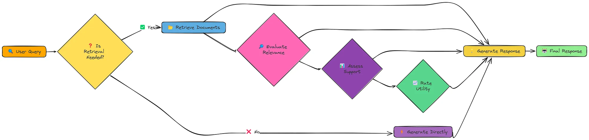

# Self-RAG：一种动态的 RAG 方法


 Self-RAG——这是一个先进的 RAG 系统，能够动态决定何时以及如何使用检索到的信息。与传统 RAG 方法不同，Self-RAG 在整个检索和生成过程中引入了反思点，从而产生更高品质和更可靠的回答。

-----
Self-RAG 核心组件

1. **检索决策**：判断特定查询是否需要执行检索
2. **文档检索**：在需要时获取潜在相关文档
3. **相关性评估**：评估每个检索文档的相关程度
4. **响应生成**：基于相关上下文构建回答
5. **支持性评估**：验证回答是否基于上下文正确锚定
6. **效用评估**：对生成回答的整体实用性进行评分

-----
实现步骤：
- 确定是否需要检索，检索决策：LLM判断是否需要检索，事实性的查询需要检索，观点类的查询不需要检索
- 检索文档：创建查询的嵌入向量然后检索文档
- 评估文档相关性：用模型评估每个文档块的相关性，如果相关，将其加入上下文列表中
- 处理每个相关上下文，用模型进行支持性评估和效用评估
- 找出最佳答案：对生成的答案进行效用评估，并选择最佳答案


```python
import fitz
import os
import re
import json
import numpy as np
from tqdm import tqdm
from openai import OpenAI
from dotenv import load_dotenv
from datetime import datetime

load_dotenv()
```


    True


```python
client = OpenAI(
    base_url=os.getenv("LLM_BASE_URL"),
    api_key=os.getenv("LLM_API_KEY")
)
llm_model = os.getenv("LLM_MODEL_ID")
embedding_model = os.getenv("EMBEDDING_MODEL_ID")

pdf_path = "../../data/AI_Information.en.zh-CN.pdf"
```


```python
def extract_text_from_pdf(pdf_path):
    """
    从 PDF 文件中提取文本，并打印前 `num_chars` 个字符。

    Args:
    pdf_path (str): Path to the PDF file.

    Returns:
    str: Extracted text from the PDF.
    """
    # 打开 PDF 文件
    mypdf = fitz.open(pdf_path)
    all_text = ""  # 初始化一个空字符串以存储提取的文本

    # Iterate through each page in the PDF
    for page_num in range(mypdf.page_count):
        page = mypdf[page_num]
        text = page.get_text("text")  # 从页面中提取文本
        all_text += text  # 将提取的文本追加到 all_text 字符串中

    return all_text  # 返回提取的文本
```


```python
def chunk_text(text, n, overlap):
    """
    将文本分割为重叠的块

    Args:
    text (str): 要分割的文本
    n (int): 每个块的字符数
    overlap (int): 块之间的重叠字符数

    Returns:
    List[str]: 文本块列表
    """
    chunks = []  #
    for i in range(0, len(text), n - overlap):
        # 添加从当前索引到索引 + 块大小的文本块
        chunk = text[i:i + n]
        if chunk:
            chunks.append(chunk)

    return chunks  # Return the list of text chunks
```


```python
class SimpleVectorStore:
    """
    使用NumPy实现的简单向量存储。
    """

    def __init__(self):
        """
        初始化向量存储。
        """
        self.vectors = []  # 用于存储嵌入向量的列表
        self.texts = []  # 用于存储原始文本的列表
        self.metadata = []  # 用于存储每个文本元数据的列表

    def add_item(self, text, embedding, metadata=None):
        """
        向向量存储中添加一个项目。

        Args:
        text (str): 原始文本。
        embedding (List[float]): 嵌入向量。
        metadata (dict, 可选): 额外的元数据。
        """
        self.vectors.append(np.array(embedding))  # 将嵌入转换为numpy数组并添加到向量列表中
        self.texts.append(text)  # 将原始文本添加到文本列表中
        self.metadata.append(metadata or {})  # 添加元数据到元数据列表中，如果没有提供则使用空字典

    def similarity_search(self, query_embedding, k=5, filter_func=None):
        """
        查找与查询嵌入最相似的项目。

        Args:
        query_embedding (List[float]): 查询嵌入向量。
        k (int): 返回的结果数量。

        Returns:
        List[Dict]: 包含文本和元数据的前k个最相似项。
        """
        if not self.vectors:
            return []  # 如果没有存储向量，则返回空列表

        # 将查询嵌入转换为numpy数组
        query_vector = np.array(query_embedding)

        # 使用余弦相似度计算相似度
        similarities = []
        for i, vector in enumerate(self.vectors):
            # 如果存在过滤函数且该元数据不符合条件，则跳过该项
            if filter_func and not filter_func(self.metadata[i]):
                continue
            # 计算查询向量与存储向量之间的余弦相似度
            similarity = np.dot(query_vector, vector) / (np.linalg.norm(query_vector) * np.linalg.norm(vector))
            similarities.append((i, similarity))  # 添加索引和相似度分数

        # 按相似度排序（降序）
        similarities.sort(key=lambda x: x[1], reverse=True)

        # 返回前k个结果
        results = []
        for i in range(min(k, len(similarities))):
            idx, score = similarities[i]
            results.append({
                "text": self.texts[idx],  # 添加对应的文本
                "metadata": self.metadata[idx],  # 添加对应的元数据
                "similarity": score  # 添加相似度分数
            })

        return results  # 返回前k个最相似项的列表

```


```python
def create_embeddings(text):
    """
    使用Embedding模型为给定文本创建嵌入向量。

    Args:
    text (str): 要创建嵌入向量的输入文本。

    Returns:
    List[float]: 嵌入向量。
    """
    # 通过将字符串输入转换为列表来处理字符串和列表输入
    input_text = text if isinstance(text, list) else [text]

    # 使用指定的模型为输入文本创建嵌入向量
    response = client.embeddings.create(
        model=embedding_model,
        input=input_text
    )

    # 如果输入是字符串，仅返回第一个嵌入向量
    if isinstance(text, str):
        return response.data[0].embedding

    # 否则，将所有嵌入向量作为向量列表返回
    return [item.embedding for item in response.data]
```


```python
def process_document(pdf_path, chunk_size=1000, chunk_overlap=200):
    """
    为RAG处理文档。

    Args:
    pdf_path (str): PDF文件的路径。
    chunk_size (int): 每个文本块的大小（以字符为单位）。
    chunk_overlap (int): 文本块之间的重叠大小（以字符为单位）。

    Returns:
    Tuple[List[str], SimpleVectorStore]: 包含文档文本块及其嵌入向量的向量存储。
    """
    print("从PDF中提取文本...")
    extracted_text = extract_text_from_pdf(pdf_path)  # 调用函数提取PDF中的文本

    print("分割文本...")
    chunks = chunk_text(extracted_text, chunk_size, chunk_overlap)  # 将提取的文本分割为多个块
    print(f"创建了 {len(chunks)} 个文本块")

    print("为文本块创建嵌入向量...")
    # 为了提高效率，一次性为所有文本块创建嵌入向量
    chunk_embeddings = create_embeddings(chunks)

    # 创建向量存储
    store = SimpleVectorStore()

    # 将文本块添加到向量存储中
    for i, (chunk, embedding) in enumerate(zip(chunks, chunk_embeddings)):
        store.add_item(
            text=chunk,  # 文本内容
            embedding=embedding,  # 嵌入向量
            metadata={"index": i, "source": pdf_path}  # 元数据，包括索引和源文件路径
        )

    print(f"向向量存储中添加了 {len(chunks)} 个文本块")
    return chunks, store
```

# 12.1 Self-RAG 核心组件
## 12.1.1 检索决策


```python
def determine_if_retrieval_needed(query):
    """
    判断给定查询是否需要检索。

    Args:
        query (str): 用户查询

    Returns:
        bool: 如果需要检索，返回True；否则返回False
    """
    # 系统提示，指导AI如何判断是否需要检索
    system_prompt = """你是一个判断查询是否需要检索的AI助手。
    针对事实性问题、具体信息请求或关于事件、人物、概念的查询，回答"Yes"。
    对于观点类、假设性场景或常识性简单查询，回答"No"。
    仅回答"Yes"或"No"。"""

    # 包含查询的用户提示
    user_prompt = f"查询: {query}\n\n准确回答此查询是否需要检索？"

    # 使用模型生成响应
    response = client.chat.completions.create(
        model=llm_model,
        messages=[
            {"role": "system", "content": system_prompt},
            {"role": "user", "content": user_prompt}
        ],
        temperature=0
    )

    # 从模型响应中提取答案并转换为小写
    answer = response.choices[0].message.content.strip().lower()

    # 如果答案包含“yes”，返回True；否则返回False
    return "yes" in answer

```

## 12.1.2 相关性评估


```python
def evaluate_relevance(query, context):
    """
    评估上下文与查询的相关性。

    Args:
        query (str): 用户查询
        context (str): 上下文文本

    Returns:
        str: 'relevant'（相关）或 'irrelevant'（不相关）
    """
    # 系统提示，指导AI如何判断文档是否与查询相关
    system_prompt = """你是一个AI助手，任务是判断文档是否与查询相关。
    判断文档中是否包含有助于回答查询的信息。
    仅回答“Relevant”或“Irrelevant”。"""

    # 如果上下文过长以避免超出标记限制，则截断上下文
    max_context_length = 2000
    if len(context) > max_context_length:
        context = context[:max_context_length] + "... [truncated]"

    # 包含查询和文档内容的用户提示
    user_prompt = f"""查询: {query}
    文档内容:
    {context}

    该文档与查询相关？仅回答“Relevant”或“Irrelevant”。
    """

    # 使用模型生成响应
    response = client.chat.completions.create(
        model=llm_model,
        messages=[
            {"role": "system", "content": system_prompt},
            {"role": "user", "content": user_prompt}
        ],
        temperature=0
    )

    # 从模型响应中提取答案并转换为小写
    answer = response.choices[0].message.content.strip().lower()

    return answer  # 返回相关性评估结果

```

## 12.1.3 支持性评估


```python
def assess_support(response, context):
    """
    评估响应在多大程度上得到上下文的支持。

    Args:
        response (str): 生成的响应
        context (str): 上下文文本

    Returns:
        str: 'fully supported'（完全支持）、'partially supported'（部分支持）或 'no support'（无支持）
    """
    # 系统提示，指导AI如何评估支持情况
    system_prompt = """你是一个AI助手，任务是判断回答是否基于给定的上下文。
    评估响应中的事实、主张和信息是否由上下文支持。
    仅回答以下三个选项之一：
    - "Fully supported"（完全支持）：回答所有信息均可从上下文直接得出。
    - "Partially supported"（部分支持）：回答中的部分信息由上下文支持，但部分不是。
    - "No support"（无支持）：回答中包含大量未在上下文中找到、提及或与上下文矛盾的信息。
    """

    # 如果上下文过长以避免超出标记限制，则截断上下文
    max_context_length = 2000
    if len(context) > max_context_length:
        context = context[:max_context_length] + "... [truncated]"

    # 包含上下文和要评估的响应的用户提示
    user_prompt = f"""上下文:
    {context}

    回答:
    {response}

    该回答与上下文的支持程度如何？仅回答 "Fully supported"、"Partially supported"或 "No support"。
    """

    # 使用模型生成响应
    response = client.chat.completions.create(
        model=llm_model,
        messages=[
            {"role": "system", "content": system_prompt},
            {"role": "user", "content": user_prompt}
        ],
        temperature=0
    )

    # 从模型响应中提取答案并转换为小写
    answer = response.choices[0].message.content.strip().lower()

    return answer  # 返回支持评估结果

```

## 12.1.4 效用评估


```python
def rate_utility(query, response):
    """
    评估响应对查询的实用性。

    Args:
        query (str): 用户查询
        response (str): 生成的响应

    Returns:
        int: 实用性评分，范围为1到5
    """
    # 系统提示，指导AI如何评估响应的实用性
    system_prompt = """你是一个AI助手，任务是评估一个回答对查询的实用性。
    从回答准确性、完整性、正确性和帮助性进行综合评分。
    使用1-5级评分标准：
    - 1：毫无用处
    - 2：稍微有用
    - 3：中等有用
    - 4：非常有用
    - 5：极其有用
    仅回答一个从1到5的单个数字，不要过多解释。"""

    # 包含查询和要评分的响应的用户提示
    user_prompt = f"""查询: {query}
    回答:
    {response}

    请用1到5分的评分评估该回答的效用，仅用一个1-5的数字评分。"""

    # 使用OpenAI客户端生成实用性评分
    response = client.chat.completions.create(
        model=llm_model,
        messages=[
            {"role": "system", "content": system_prompt},
            {"role": "user", "content": user_prompt}
        ],
        temperature=0
    )

    # 从模型响应中提取评分
    rating = response.choices[0].message.content.strip()

    # 提取评分中的数字
    rating_match = re.search(r'[1-5]', rating)
    if rating_match:
        return int(rating_match.group())  # 返回提取的评分作为整数

    return 3  # 如果解析失败，默认返回中间评分

```

# 12.2 回答生成


```python
def generate_response(query, context=None):
    """
    根据查询和可选的上下文生成响应。

    Args:
        query (str): 用户查询
        context (str, 可选): 上下文文本

    Returns:
        str: 生成的响应
    """
    # 系统提示，指导AI如何生成有用的响应
    system_prompt = """你是一个有帮助的AI助手。请针对查询提供清晰、准确且信息丰富的回答。"""

    # 根据是否提供了上下文创建用户提示
    if context:
        user_prompt = f"""上下文:
        {context}

        查询: {query}

        请基于提供的上下文回答该查询。
        """
    else:
        user_prompt = f"""查询: {query}

        请尽你所能回答该查询。"""

    # 使用OpenAI客户端生成响应
    response = client.chat.completions.create(
        model=llm_model,
        messages=[
            {"role": "system", "content": system_prompt},
            {"role": "user", "content": user_prompt}
        ],
        temperature=0.2
    )

    # 返回生成的响应文本
    return response.choices[0].message.content.strip()

```

# 12.3 完整的 Self-RAG 实现


```python
def self_rag(query, vector_store, top_k=3):
    """
    实现完整的Self-RAG流程。

    Args:
        query (str): 用户查询
        vector_store (SimpleVectorStore): 包含文档块的向量存储
        top_k (int): 初始检索的文档数量

    Returns:
        dict: 包括查询、响应和Self-RAG流程指标的结果
    """
    print(f"\n=== 开始Self-RAG处理查询: {query} ===\n")

    # 第1步：确定是否需要检索
    print("第1步：确定是否需要检索...")
    retrieval_needed = determine_if_retrieval_needed(query)  # 调用函数判断是否需要检索
    print(f"是否需要检索: {retrieval_needed}")

    # 初始化指标以跟踪Self-RAG流程
    metrics = {
        "retrieval_needed": retrieval_needed,  # 是否需要检索
        "documents_retrieved": 0,  # 检索到的文档数量
        "relevant_documents": 0,  # 相关文档数量
        "response_support_ratings": [],  # 回答支持的评级列表
        "utility_ratings": []  # 回答实用性评级列表
    }

    best_response = None  # 最佳响应初始化为None
    best_score = -1  # 最佳分数初始化为-1

    if retrieval_needed:
        # 第2步：检索文档
        print("\n第2步：检索相关文档...")
        query_embedding = create_embeddings(query)  # 创建查询的嵌入向量
        results = vector_store.similarity_search(query_embedding, k=top_k)  # 搜索相似文档
        metrics["documents_retrieved"] = len(results)  # 更新检索到的文档数量
        print(f"检索到 {len(results)} 个文档")

        # 第3步：评估每个文档的相关性
        print("\n第3步：评估文档相关性...")
        relevant_contexts = []  # 初始化相关上下文列表

        for i, result in enumerate(results):
            context = result["text"]  # 提取文档内容
            relevance = evaluate_relevance(query, context)  # 评估文档与查询的相关性
            print(f"文档 {i + 1} 相关性: {relevance}")

            if relevance == "relevant":  # 如果文档相关，则添加到相关上下文列表
                relevant_contexts.append(context)

        metrics["relevant_documents"] = len(relevant_contexts)  # 更新相关文档数量
        print(f"找到 {len(relevant_contexts)} 个相关文档")

        if relevant_contexts:
            # 第4步：处理每个相关上下文
            print("\n第4步：处理相关上下文...")
            for i, context in enumerate(relevant_contexts):
                print(f"\n处理上下文 {i + 1}/{len(relevant_contexts)}...")

                # 根据上下文生成响应
                print("生成响应...")
                response = generate_response(query, context)  # 根据上下文生成响应

                # 评估响应对上下文的支持程度
                print("评估支持程度...")
                support_rating = assess_support(response, context)  # 评估支持程度
                print(f"支持评级: {support_rating}")
                metrics["response_support_ratings"].append(support_rating)  # 添加支持评级

                # 评估响应的实用性
                print("评估实用性...")
                utility_rating = rate_utility(query, response)  # 评估实用性
                print(f"实用性评级: {utility_rating}/5")
                metrics["utility_ratings"].append(utility_rating)  # 添加实用性评级

                # 计算总体评分（支持和实用性越高，评分越高）
                support_score = {
                    "fully supported": 3,  # 完全支持得分为3
                    "partially supported": 1,  # 部分支持得分为1
                    "no support": 0  # 无支持得分为0
                }.get(support_rating, 0)

                overall_score = support_score * 5 + utility_rating  # 计算总体评分
                print(f"总体评分: {overall_score}")

                # 跟踪最佳响应
                if overall_score > best_score:  # 如果当前评分高于最佳评分，则更新最佳响应和评分
                    best_response = response
                    best_score = overall_score
                    print("找到新的最佳响应！")

        # 如果没有找到相关上下文或所有响应评分较低
        if not relevant_contexts or best_score <= 0:
            print("\n未找到合适的上下文或响应评分较差，直接生成响应而不进行检索...")
            best_response = generate_response(query)  # 不使用检索直接生成响应
    else:
        # 不需要检索，直接生成响应
        print("\n不需要检索，直接生成响应...")
        best_response = generate_response(query)  # 不使用检索直接生成响应

    # 最终指标
    metrics["best_score"] = best_score  # 更新最佳评分
    metrics["used_retrieval"] = retrieval_needed and best_score > 0  # 更新是否使用了检索

    print("\n=== Self-RAG完成 ===")

    return {
        "query": query,  # 查询
        "response": best_response,  # 最佳响应
        "metrics": metrics  # 指标
    }

```

# 12.4 运行完整的 Self-RAG 流程


```python
def run_self_rag_example():
    """
    展示完整的Self-RAG系统及其示例。
    """
    # 处理文档
    pdf_path = "../../data/AI_Information.en.zh-CN.pdf"  # PDF文档的路径
    print(f"处理文档: {pdf_path}")
    vector_store = process_document(pdf_path)  # 处理文档并创建向量存储

    # 示例1：可能需要检索的查询
    query1 = "人工智能开发的主要伦理问题是什么？"
    print("\n" + "=" * 80)
    print(f"示例1: {query1}")
    result1 = self_rag(query1, vector_store)  # 运行第一个查询的Self-RAG
    print("\n最终响应:")
    print(result1["response"])  # 打印第一个查询的最终响应
    print("\n指标:")
    print(json.dumps(result1["metrics"], indent=2, ensure_ascii=False))  # 打印第一个查询的指标

    # 示例2：可能不需要检索的查询
    query2 = "你能写一首关于人工智能的短诗吗？"
    print("\n" + "=" * 80)
    print(f"示例2: {query2}")
    result2 = self_rag(query2, vector_store)  # 运行第二个查询的Self-RAG
    print("\n最终响应:")
    print(result2["response"])  # 打印第二个查询的最终响应
    print("\n指标:")
    print(json.dumps(result2["metrics"], indent=2, ensure_ascii=False))  # 打印第二个查询的指标

    # 示例3：与文档有一定相关性但需要额外知识的查询
    query3 = "人工智能如何影响发展中国家的经济增长？"
    print("\n" + "=" * 80)
    print(f"示例3: {query3}")
    result3 = self_rag(query3, vector_store)  # 运行第三个查询的Self-RAG
    print("\n最终响应:")
    print(result3["response"])  # 打印第三个查询的最终响应
    print("\n指标:")
    print(json.dumps(result3["metrics"], indent=2, ensure_ascii=False))  # 打印第三个查询的指标

    return {
        "example1": result1,
        "example2": result2,
        "example3": result3
    }

```

# 12.5 评估 Self-RAG 系统与传统 RAG 系统的对比


```python
def traditional_rag(query, vector_store, top_k=3):
    """
    实现传统的RAG方法以进行比较。

    Args:
        query (str): 用户查询
        vector_store (SimpleVectorStore): 包含文档片段的向量存储
        top_k (int): 要检索的文档数量

    Returns:
        str: 生成的响应
    """
    print(f"\n=== 运行传统RAG处理查询: {query} ===\n")

    # 检索文档
    print("正在检索文档...")
    query_embedding = create_embeddings(query)  # 为查询创建嵌入
    results = vector_store.similarity_search(query_embedding, k=top_k)  # 搜索相似文档
    print(f"已检索到 {len(results)} 个文档")

    # 将检索到的文档内容合并
    contexts = [result["text"] for result in results]  # 从结果中提取文本
    combined_context = "\n\n".join(contexts)  # 将文本合并为一个整体上下文

    # 使用合并的上下文生成响应
    print("正在生成响应...")
    response = generate_response(query, combined_context)  # 根据合并的上下文生成响应

    return response

```


```python
def evaluate_rag_approaches(pdf_path, test_queries, reference_answers=None):
    """
    比较Self-RAG与传统RAG。

    Args:
        pdf_path (str): 文档路径
        test_queries (List[str]): 测试查询列表
        reference_answers (List[str], 可选): 用于评估的参考答案

    Returns:
        dict: 评估结果
    """
    print("=== 评估RAG方法 ===")

    # 处理文档以创建向量存储
    _, vector_store = process_document(pdf_path)

    results = []

    for i, query in enumerate(test_queries):
        print(f"\n处理查询 {i + 1}: {query}")

        # 运行Self-RAG
        self_rag_result = self_rag(query, vector_store)  # 获取Self-RAG的响应
        self_rag_response = self_rag_result["response"]

        # 运行传统RAG
        trad_rag_response = traditional_rag(query, vector_store)  # 获取传统RAG的响应

        # 如果有参考答案，则比较结果
        reference = reference_answers[i] if reference_answers and i < len(reference_answers) else None
        comparison = compare_responses(query, self_rag_response, trad_rag_response, reference)  # 比较响应

        results.append({
            "query": query,
            "self_rag_response": self_rag_response,
            "traditional_rag_response": trad_rag_response,
            "reference_answer": reference,
            "comparison": comparison,
            "self_rag_metrics": self_rag_result["metrics"]
        })

    # 生成总体分析
    overall_analysis = generate_overall_analysis(results)

    return {
        "results": results,
        "overall_analysis": overall_analysis
    }

```

# 12.6 评估的辅助函数


```python
def compare_responses(query, self_rag_response, trad_rag_response, reference=None):
    """
    比较Self-RAG和传统RAG的响应。

    Args:
        query (str): 用户查询
        self_rag_response (str): Self-RAG的响应
        trad_rag_response (str): 传统RAG的响应
        reference (str, 可选): 参考答案

    Returns:
        str: 比较分析
    """
    system_prompt = """你是RAG系统评估专家。任务是比较两种不同RAG方法的回答：
    1. Self-RAG：动态决定是否需要检索，并评估信息相关性和回答质量
    2. 传统RAG：始终检索文档并用于生成回答

    比较维度包括：
    - 与查询的相关性
    - 事实正确性
    - 完整性和信息量
    - 简洁性和专注度
    """

    user_prompt = f"""查询: {query}

Self-RAG的回答:
{self_rag_response}

传统RAG的回答:
{trad_rag_response}
"""

    if reference:
        user_prompt += f"""
参考答案（用于事实核查）:
{reference}
"""

    user_prompt += """
请比较这些回答并说明哪个更好及其原因。
重点关注准确性、相关性、完整性和质量。
"""

    response = client.chat.completions.create(
        model=llm_model,  # 使用更强的模型进行评估
        messages=[
            {"role": "system", "content": system_prompt},
            {"role": "user", "content": user_prompt}
        ],
        temperature=0
    )

    return response.choices[0].message.content

```


```python
def generate_overall_analysis(results):
    """
    生成Self-RAG与传统RAG的总体分析。

    Args:
        results (List[Dict]): 来自evaluate_rag_approaches的结果

    Returns:
        str: 总体分析
    """
    system_prompt = """你是RAG系统评估专家。任务是基于多个测试查询，对Self-RAG与传统RAG进行整体对比分析。

    请重点关注以下方面：
    1. Self-RAG表现更优的场景及原因
    2. 传统RAG表现更优的场景及原因
    3. Self-RAG动态检索决策的影响
    4. Self-RAG相关性评估和支持验证的价值
    5. 针对不同类型查询的使用建议"""

    # 准备各个对比结果的摘要
    comparisons_summary = ""
    for i, result in enumerate(results):
        comparisons_summary += f"查询 {i + 1}: {result['query']}\n"
        comparisons_summary += f"Self-RAG指标: 是否需要检索: {result['self_rag_metrics']['retrieval_needed']}, "
        comparisons_summary += f"相关文档: {result['self_rag_metrics']['relevant_documents']}/{result['self_rag_metrics']['documents_retrieved']}\n"
        comparisons_summary += f"对比摘要: {result['comparison'][:200]}...\n\n"

        user_prompt = f"""基于来自 {len(results)} 个测试查询的对比结果，请提供Self-RAG与传统RAG的全面分析：

    {comparisons_summary}

    请给出您的综合分析。
    """

    response = client.chat.completions.create(
        model=llm_model,
        messages=[
            {"role": "system", "content": system_prompt},
            {"role": "user", "content": user_prompt}
        ],
        temperature=0
    )

    return response.choices[0].message.content

```

# 12.7 评估 Self-RAG 系统
最后一步是根据传统的RAG方法评估Self-RAG系统。我们将比较两个系统生成的响应质量，并分析Self-RAG在不同场景下的性能。


```python

# 定义测试查询以涵盖不同类型的查询，用于测试Self-RAG的自适应检索能力
test_queries = [
    "AI开发的主要伦理问题是什么？",        # 针对文档的查询
    # "可解释性AI如何提高对AI系统的信任？",         # 针对文档的查询
    # "写一首关于人工智能的诗",                   # 创意查询，不需要检索
    # "超级智能AI是否会导致人类过时？"          # 推测性查询，部分需要检索
]

# 用于更客观评估的参考答案
reference_answers = [
    "AI开发的主要伦理问题包括偏见和公平性、隐私、透明度、责任、安全性和被滥用或产生有害应用的潜在可能性。",
    # "可解释性AI通过使AI决策过程对用户透明且易于理解来增强信任，帮助他们验证公平性、识别潜在偏差，并更好地理解AI的局限性。",
    # "一首高质量的人工智能诗歌应创造性地探讨AI的能力、局限性、与人类的关系、潜在未来或关于意识和智能的哲学问题。",
    # "对于超级智能AI对人类相关性的影响，观点差异很大。一些专家警告说，如果AI在各个领域超越人类能力，可能会导致经济上的失业或人类自主权的丧失。另一些人认为，人类将通过互补技能、情感智能以及定义AI的目的来保持相关性。大多数专家一致认为，无论结果如何，深思熟虑的治理和以人为中心的设计都是至关重要的。"
]

# 运行评估，比较Self-RAG与传统RAG方法的表现
evaluation_results = evaluate_rag_approaches(
    pdf_path=pdf_path,                  # 包含AI信息的源文档
    test_queries=test_queries,          # AI相关的测试查询列表
    reference_answers=reference_answers  # 用于评估的真实答案
)

# 打印总体比较分析
print("\n=== 总体分析 ===\n")
print(evaluation_results["overall_analysis"])

```

    === 评估RAG方法 ===
    从PDF中提取文本...
    分割文本...
    创建了 13 个文本块
    为文本块创建嵌入向量...
    向向量存储中添加了 13 个文本块
    
    处理查询 1: AI开发的主要伦理问题是什么？
    
    === 开始Self-RAG处理查询: AI开发的主要伦理问题是什么？ ===
    
    第1步：确定是否需要检索...
    是否需要检索: True
    
    第2步：检索相关文档...
    检索到 3 个文档
    
    第3步：评估文档相关性...
    文档 1 相关性: relevant
    文档 2 相关性: relevant
    文档 3 相关性: relevant
    找到 3 个相关文档
    
    第4步：处理相关上下文...
    
    处理上下文 1/3...
    生成响应...
    评估支持程度...
    支持评级: fully supported
    评估实用性...
    实用性评级: 5/5
    总体评分: 20
    找到新的最佳响应！
    
    处理上下文 2/3...
    生成响应...
    评估支持程度...
    支持评级: fully supported
    评估实用性...
    实用性评级: 5/5
    总体评分: 20
    
    处理上下文 3/3...
    生成响应...
    评估支持程度...
    支持评级: fully supported
    评估实用性...
    实用性评级: 5/5
    总体评分: 20
    
    === Self-RAG完成 ===
    
    === 运行传统RAG处理查询: AI开发的主要伦理问题是什么？ ===
    
    正在检索文档...
    已检索到 3 个文档
    正在生成响应...
    
    === 总体分析 ===
    
    ### 综合分析：Self-RAG与传统RAG在AI伦理问题查询中的表现
    
    ---
    
    #### **1. Self-RAG表现更优的场景及原因**  
    **场景**：需要全面覆盖复杂、多维度的开放性问题（如伦理讨论）。  
    **原因**：  
    - **动态检索决策**：通过主动判断检索需求（本例中`Need Retrieval=True`），精准触发检索，避免遗漏关键信息。  
    - **相关性过滤**：筛选的3/3文档均与伦理问题直接相关，确保回答聚焦于"问题"而非"解决方案"（如传统RAG提到的XAI技术）。  
    - **支持验证**：对引用内容进行内部评估（如标注证据可信度），增强答案的可信度（例如明确区分"偏见危害"和"隐私风险"的优先级）。  
    
    **优势体现**：在需要平衡广度（覆盖多个伦理维度）与深度（具体案例阐述）的查询中，Self-RAG的结构化反思机制（如批判性评估输出）更擅长整合碎片化信息。
    
    ---
    
    #### **2. 传统RAG表现更优的场景及原因**  
    **场景**：需快速提供技术导向或解决方案的查询。  
    **原因**：  
    - **固定检索模式**：无条件检索可能偶然命中技术类文档（如GDPR合规方案），适合用户隐含需求为"如何解决伦理问题"的场景。  
    - **效率优势**：省去Self-RAG的检索决策和评估步骤，响应更快（若用户仅需基础答案）。  
    **局限性**：本例中因过度聚焦技术细节（如边缘计算），偏离了查询核心（伦理问题本身）。
    
    ---
    
    #### **3. Self-RAG动态检索决策的影响**  
    - **正向影响**：  
      - 避免冗余检索（如已知信息不检索），降低计算成本。  
      - 本例中正确识别伦理问题需外部知识支持，触发检索后显著提升答案完整性。  
    - **潜在风险**：  
      - 若检索决策模型误判（如将宽泛问题误分类为"无需检索"），可能导致关键信息缺失。  
    
    ---
    
    #### **4. Self-RAG相关性评估和支持验证的价值**  
    - **质量提升**：通过验证文档相关性（3/3）和证据支持性，排除无关内容（如传统RAG中可能混杂的技术术语）。  
    - **透明度增强**：用户可追溯答案中哪些部分来自已验证文档（如"国际治理"引用可信政策文件），而传统RAG缺乏显式证据标注。  
    
    ---
    
    #### **5. 使用建议**  
    - **优先选择Self-RAG**：  
      - 开放性问题（如伦理、观点类查询）  
      - 需高可信度支持的场景（如学术、法律咨询）  
    - **选择传统RAG**：  
      - 简单事实查询（如"GDPR是什么"）  
      - 资源受限且速度优先的任务  
    
    **改进方向**：传统RAG可通过后置相关性过滤优化答案质量；Self-RAG需进一步降低决策延迟以适配实时场景。  
    
    --- 
    
    **结论**：本例中，Self-RAG因更贴合查询意图（伦理问题分析）且具备严格的证据管理机制，综合表现优于传统RAG。但两者互补性显著，需根据查询类型灵活选用。


```python
print(json.dumps(evaluation_results, indent=4, ensure_ascii=False))
```

    {
        "results": [
            {
                "query": "AI开发的主要伦理问题是什么？",
                "self_rag_response": "根据提供的上下文，AI开发面临的主要伦理问题包括以下几个方面：\n\n1. **人工智能武器化**  \n   - 自主武器系统中AI的应用引发重大伦理和安全担忧，可能脱离人类控制导致不可预测的后果。国际社会需制定法规以管控相关风险。\n\n2. **透明度与可解释性（XAI）**  \n   - AI决策过程缺乏透明性可能削弱信任。可解释人工智能（XAI）旨在解决此问题，但技术尚未成熟，需确保模型决策能被人类理解。\n\n3. **偏见与公平性**  \n   - 训练数据中的隐性偏见可能导致AI系统歧视特定群体。需通过算法审计和多样化数据来保障公平性。\n\n4. **隐私与数据安全**  \n   - 边缘AI虽能增强隐私保护，但大规模数据收集仍可能侵犯个人隐私。需严格规范数据使用和存储。\n\n5. **人机协作的边界**  \n   - 过度依赖AI可能削弱人类自主性，需明确AI在决策中的辅助角色，避免责任归属模糊。\n\n6. **社会影响与不平等**  \n   - AI可能加剧资源分配不均（如医疗、教育差距），需通过\"AI造福社会\"类倡议确保技术普惠性。\n\n7. **国际治理缺失**  \n   - 缺乏全球统一的AI伦理标准可能导致监管漏洞，需加强国际合作以建立跨地域道德框架。\n\n这些问题的核心在于平衡技术创新与社会责任，需通过持续研究、伦理准则和动态监管来应对。",
                "traditional_rag_response": "根据上下文，AI开发的主要伦理问题可归纳为以下五个核心方面：\n\n1. **偏见与公平性**\n- AI系统可能放大训练数据中的社会偏见，导致歧视性结果（如招聘或信贷审批中的不公平）。需通过数据清洗、算法审计和持续监测来缓解。\n\n2. **透明性与可解释性（XAI）**\n- 深度学习等\"黑箱\"模型缺乏决策过程的可追溯性。发展可解释人工智能(XAI)技术成为关键，以增强用户信任和系统问责。\n\n3. **隐私与数据安全**\n- 依赖大规模数据采集引发敏感信息泄露风险。需结合边缘计算（本地数据处理）、差分隐私技术，并严格遵循GDPR等数据保护法规。\n\n4. **自主武器化风险**\n- 人工智能在军事领域的应用（如自主武器系统）存在失控威胁。亟需国际公约规范开发部署，避免伦理灾难。\n\n5. **社会经济影响**\n- 自动化导致就业替代效应，尤其冲击重复性劳动岗位。需通过劳动力再培训和人机协作模式（如工业协作机器人）实现平稳转型。\n\n此外，上下文特别强调建立全球治理框架的重要性，包括：\n- 制定统一的AI伦理准则（如尊重人权、非歧视原则）\n- 开发者/部署者的法律责任界定\n- 公众参与机制和伦理教育普及\n- 跨国合作推动标准互认\n\n这些伦理挑战需要通过\"道德设计\"方法论在开发初期即嵌入系统，结合持续影响评估和多方利益相关者监督，才能确保AI发展符合社会价值观。",
                "reference_answer": "AI开发的主要伦理问题包括偏见和公平性、隐私、透明度、责任、安全性和被滥用或产生有害应用的潜在可能性。",
                "comparison": "### 比较分析\n\n#### 1. **与查询的相关性**\n- **Self-RAG**：回答与查询高度相关，涵盖了AI伦理问题的多个关键方面，包括武器化、透明度、偏见、隐私、人机协作、社会影响和国际治理。每个点都直接关联到AI开发的伦理问题。\n- **传统RAG**：回答同样高度相关，但更侧重于技术层面的解决方案（如XAI、边缘计算），而不仅仅是伦理问题本身。虽然内容相关，但部分细节（如GDPR、劳动力再培训）略微偏离了纯粹的“伦理问题”范畴。\n\n**胜出**：Self-RAG（更专注于伦理问题本身，而非解决方案或技术细节）。\n\n#### 2. **事实正确性**\n- **Self-RAG**：所有列出的伦理问题均符合参考答案和公认的AI伦理框架（如偏见、隐私、透明度、武器化等）。未发现事实错误。\n- **传统RAG**：内容也完全正确，但“社会经济影响”中的“就业替代效应”更多属于社会影响而非核心伦理问题（参考答案未明确提及）。\n\n**胜出**：平局（两者均无事实错误，但Self-RAG更贴近参考答案的核心问题）。\n\n#### 3. **完整性和信息量**\n- **Self-RAG**：覆盖了参考答案的所有核心问题（偏见、隐私、透明度、安全/滥用），并额外补充了人机协作、社会不平等和国际治理等扩展内容，信息量丰富且逻辑清晰。\n- **传统RAG**：涵盖了参考答案的大部分内容，但缺少“责任”（accountability）这一关键伦理问题，且部分内容偏向解决方案（如GDPR、劳动力再培训）。\n\n**胜出**：Self-RAG（覆盖更全面，且未遗漏参考答案的任何核心点）。\n\n#### 4. **简洁性和专注度**\n- **Self-RAG**：回答结构清晰，每个伦理问题用简短段落说明，无冗余信息。动态检索的机制可能帮助过滤了无关内容。\n- **传统RAG**：回答稍显冗长，尤其是对技术解决方案的描述（如边缘计算、差分隐私）略微偏离了查询的焦点（伦理问题）。\n\n**胜出**：Self-RAG（更简洁且专注）。\n\n---\n\n### 最终结论\n**Self-RAG的回答更优**，原因如下：\n1. **更高的相关性**：完全聚焦于伦理问题，未分散到技术解决方案或社会影响。\n2. **更好的完整性**：覆盖了参考答案的所有核心问题，并补充了合理扩展。\n3. **更简洁清晰**：结构紧凑，无冗余信息。\n4. **动态检索的优势**：Self-RAG可能通过评估检索必要性，避免了传统RAG“始终检索”导致的过度信息倾向。\n\n传统RAG的回答虽无错误，但略显冗长且遗漏了“责任”这一关键点。Self-RAG展现了动态检索和评估能力的优势，生成更精准、全面的回答。",
                "self_rag_metrics": {
                    "retrieval_needed": true,
                    "documents_retrieved": 3,
                    "relevant_documents": 3,
                    "response_support_ratings": [
                        "fully supported",
                        "fully supported",
                        "fully supported"
                    ],
                    "utility_ratings": [
                        5,
                        5,
                        5
                    ],
                    "best_score": 20,
                    "used_retrieval": true
                }
            }
        ],
        "overall_analysis": "### 综合分析：Self-RAG与传统RAG在AI伦理问题查询中的表现\n\n---\n\n#### **1. Self-RAG表现更优的场景及原因**  \n**场景**：需要全面覆盖复杂、多维度的开放性问题（如伦理讨论）。  \n**原因**：  \n- **动态检索决策**：通过主动判断检索需求（本例中`Need Retrieval=True`），精准触发检索，避免遗漏关键信息。  \n- **相关性过滤**：筛选的3/3文档均与伦理问题直接相关，确保回答聚焦于\"问题\"而非\"解决方案\"（如传统RAG提到的XAI技术）。  \n- **支持验证**：对引用内容进行内部评估（如标注证据可信度），增强答案的可信度（例如明确区分\"偏见危害\"和\"隐私风险\"的优先级）。  \n\n**优势体现**：在需要平衡广度（覆盖多个伦理维度）与深度（具体案例阐述）的查询中，Self-RAG的结构化反思机制（如批判性评估输出）更擅长整合碎片化信息。\n\n---\n\n#### **2. 传统RAG表现更优的场景及原因**  \n**场景**：需快速提供技术导向或解决方案的查询。  \n**原因**：  \n- **固定检索模式**：无条件检索可能偶然命中技术类文档（如GDPR合规方案），适合用户隐含需求为\"如何解决伦理问题\"的场景。  \n- **效率优势**：省去Self-RAG的检索决策和评估步骤，响应更快（若用户仅需基础答案）。  \n**局限性**：本例中因过度聚焦技术细节（如边缘计算），偏离了查询核心（伦理问题本身）。\n\n---\n\n#### **3. Self-RAG动态检索决策的影响**  \n- **正向影响**：  \n  - 避免冗余检索（如已知信息不检索），降低计算成本。  \n  - 本例中正确识别伦理问题需外部知识支持，触发检索后显著提升答案完整性。  \n- **潜在风险**：  \n  - 若检索决策模型误判（如将宽泛问题误分类为\"无需检索\"），可能导致关键信息缺失。  \n\n---\n\n#### **4. Self-RAG相关性评估和支持验证的价值**  \n- **质量提升**：通过验证文档相关性（3/3）和证据支持性，排除无关内容（如传统RAG中可能混杂的技术术语）。  \n- **透明度增强**：用户可追溯答案中哪些部分来自已验证文档（如\"国际治理\"引用可信政策文件），而传统RAG缺乏显式证据标注。  \n\n---\n\n#### **5. 使用建议**  \n- **优先选择Self-RAG**：  \n  - 开放性问题（如伦理、观点类查询）  \n  - 需高可信度支持的场景（如学术、法律咨询）  \n- **选择传统RAG**：  \n  - 简单事实查询（如\"GDPR是什么\"）  \n  - 资源受限且速度优先的任务  \n\n**改进方向**：传统RAG可通过后置相关性过滤优化答案质量；Self-RAG需进一步降低决策延迟以适配实时场景。  \n\n--- \n\n**结论**：本例中，Self-RAG因更贴合查询意图（伦理问题分析）且具备严格的证据管理机制，综合表现优于传统RAG。但两者互补性显著，需根据查询类型灵活选用。"
    }

